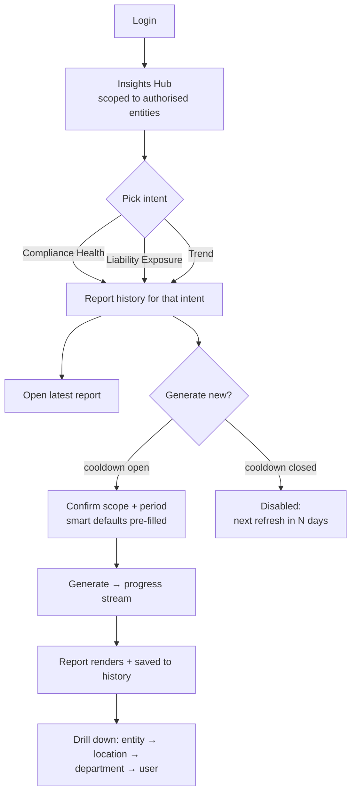
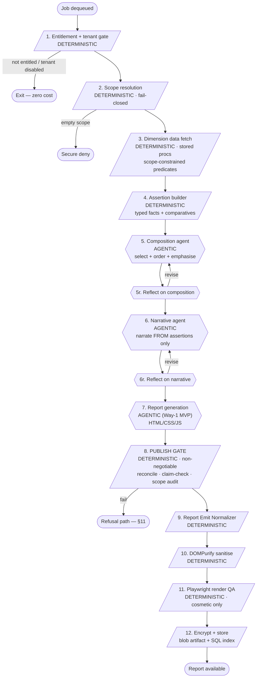
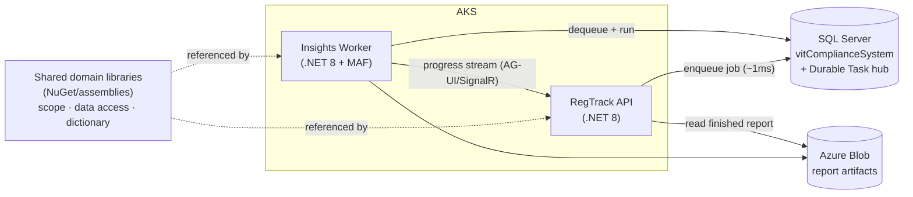

# RegTrack Insights — System Design & Build Specification

**Version:** 1.0
**Date:** 2026-07-14
**Owner:** Vinay Khosla, Senior Product Manager, TeamLease Regtech
**Status:** Design locked for MVP (Phase 1). Open items listed in §16.
**Intended builder:** Claude Code, with an assisting developer.

---

## 0. How to use this document

### 0.1 Who this is for

This document is written to be executed by **Claude Code** with a developer assisting. It therefore tries to do three things at once, and you should read it expecting all three:

1. **What** to build — the components, contracts, and behaviours.
2. **Why** it is built that way — the reasoning behind each decision, including the alternatives we rejected and *why* we rejected them.
3. **How** to build it — concrete enough that an agent can act, including schema names, real field semantics, and worked examples.

The "why" is not decoration. This system was designed by grilling every decision against real production data, and several of the most important rules exist because a naive implementation was tried in analysis and found to be **silently wrong**. If you change a decision without understanding its rationale, you will very likely re-introduce a bug we already found and fixed. Where a rule exists because of a specific discovered failure, that discovery is recorded inline.

### 0.2 Status markers

Throughout this document:

| Marker | Meaning |
|---|---|
| **[LOCKED]** | Decided. Build it this way. Changing it requires re-opening the decision with the product owner. |
| **[DEFERRED]** | Deliberately out of MVP scope. The architecture must not preclude it, but do not build it now. |
| **[OPEN]** | Genuinely unresolved. Needs an answer before the affected component ships. Listed in §16. |
| **[TRAP]** | A place where the obvious implementation is wrong. Read carefully. |

### 0.3 Reading order

- If you are **orienting**: §1, §2, §3.1–3.3, then §17 (build sequence).
- If you are **building the engine**: §3, §4, §6, §7.
- If you are **building access/security**: §5, §8, §9.
- If you are **building the free tier**: §5, §6, §10.
- If you are about to **change a decision**: §15 (decision log) first, always.

### 0.4 The five non-negotiables

Everything else in this document is detail. These five are the spine. If a proposed change violates one of these, it is wrong by default:

1. **Determinism owns truth and safety; the agent owns judgement.**
   Scope resolution, SQL execution, reconciliation, and rendering are permanently deterministic. The agent decides *what matters, in what order, and how to say it* — never *what the number is* or *who may see it*. (§3.1)

2. **Fail closed, and fail loudly.**
   An unknown enum, an empty scope, a failed reconciliation, or an unverifiable claim must **refuse and log**, never guess or default. A refused report is a good outcome. A wrong number with a provenance badge is a catastrophic one. (§6.5, §11)

3. **Every number is reconciled before it is shown.**
   Decompositions must sum to their totals; per-dimension sums must tie to tenant control totals; every headline figure is independently re-derived. No estimated or inferred number ever enters a shared deliverable without an explicit flag. (§6.9)

4. **Semantics live in one versioned dictionary, never in a WHERE clause.**
   Status buckets, enum meanings, and flag polarities are defined once, centrally, and read by every procedure and aggregator. (§6.1)

5. **The narrative may only assert what the data layer has verified.**
   Every quantitative and comparative claim in generated prose must map to a typed assertion emitted by the deterministic layer. Comparatives are *computed*, not *phrased*. (§6.10)

---

## 1. What we are building

### 1.1 The problem

RegTrack tracks statutory compliance for ~600 tenants across thousands of legal entities. It is very good at telling a user *what is due* and *what is overdue*. It is not good at telling a Chief Compliance Officer, a group compliance head, or an entity head:

- How healthy is my compliance estate, overall?
- Where is my real exposure — financial, personal-liability, operational?
- Am I getting better or worse?
- Which entities, locations, people, or laws are dragging me down, and why?

Today that analysis is done manually, ad hoc, in spreadsheets, by people who already have a full-time job. **RegTrack Insights** is the engine that produces it automatically, accurately, and in a form a CCO can act on in minutes.

### 1.2 Two products, one engine

The capability ships as **two distinct products**, which already exist in the `Product` table of `vitComplianceSystem`:

| Product Id | Name | Tier | Delivery | Audience |
|---|---|---|---|---|
| **18** | RegInsights Basic | Free | Weekly email digest | All tenants' designated management users |
| **19** | RegInsights Pro | Paid | In-app interactive report | Subscribing tenants' management users |

> **[LOCKED]** Both products exist in the catalog and are currently **unmapped to any customer** — this is greenfield. No legacy mapping state to migrate.

They share the **bottom half of the stack** and diverge at the top:

```
                    ┌─────────────────────────────┐
                    │   SHARED FOUNDATION          │
                    │  • Scope resolution service  │
                    │  • Classification dictionary │
                    │  • Reconciled stored procs   │
                    │  • SQL data layer            │
                    └──────────────┬───────────────┘
                                   │
                 ┌─────────────────┴─────────────────┐
                 ▼                                   ▼
    ┌────────────────────────┐        ┌──────────────────────────┐
    │  FREE (Product 18)      │        │  PAID (Product 19)        │
    │  deterministic aggregate│        │  agentic compose          │
    │  → capped LLM summary   │        │  → dynamic HTML report    │
    │  → email                │        │  → in-app, interactive    │
    └────────────────────────┘        └──────────────────────────┘
```

**Why they must share the foundation:** if the free digest says "183 items carry personal liability" and the paid report says something different for the same tenant and period, you have destroyed trust in both. The numbers come from the same reconciled procedures. This is not an optimisation; it is a correctness requirement.

### 1.3 MVP scope

**In scope for Phase 1 (MVP):**

- Predefined dimensions and report types only (§7).
- Live data — reports reflect the database at generation time.
- Agentic orchestration, composition, and narrative synthesis with reflection loops.
- Intent-first hub, one-click generation, scope-owned report history.
- 30-day cooldown per `(scope, report-type, period)`.
- Free weekly digest for all entitled tenants.
- Way-1 presentation (LLM-authored HTML) behind hardened containment (§8).

**Explicitly [DEFERRED] to Phase 2+:**

| Deferred | Why deferred | What it depends on |
|---|---|---|
| Immutable data snapshots | Cost/complexity; drift accepted for MVP | — |
| Run-vs-run comparison / delta | Meaningless without snapshots | Snapshots |
| Conversational Q&A over reports | Depends on a queryable frozen data layer | Snapshots |
| Custom (agentic-SQL) dimensions | Half the build for the riskiest quarter of value | Linter, quarantine, interactive loop |
| Way-2 trusted renderer | Way-1 accepted for MVP with documented residual risk | Component library |
| Backlog-level trend over time | Not retroactively computable — state was never captured | Snapshots accumulating prospectively |
| Customer-managed keys (CMK) | **Never required** — dropped permanently, not deferred | — |

> **[TRAP]** Snapshots, delta, and Q&A are **one decision, not three**. Delta and Q&A both require a frozen, queryable data layer. Do not attempt to build either before snapshots exist.

**Important distinction — stored outputs vs data snapshots.** MVP *does* persist finished report artifacts so that history works (§9). That is **not** the same as an immutable data snapshot. Stored output = the rendered report, viewable forever, static. Data snapshot = the atomic row-level data beneath it, queryable, which powers drill-into-new-cuts, Q&A, and delta. MVP has the former, not the latter.

### 1.4 Accepted consequence of live data

Because MVP reads live data, **two runs of the same report for the same period can produce different numbers.** This was observed directly during design: an identical overdue query returned 1,387 → 1,398 → 1,116 over the course of a single working session, because `RecentComplianceTransactionView` is actively refreshed (its sibling `flash_RecentComplianceTransactionView` is truncate-and-repopulate).

Notably, **stock metrics were rock-stable** (total instances, critical count, imprisonment count, type mix). Only **flow/overdue** metrics drifted.

Mitigations, all [LOCKED]:

- Every report carries a visible label: *"Generated at {timestamp} — reflects live data."*
- The 30-day cooldown means a tenant would rarely re-run inside a drift window anyway. The cooldown and the live-data decision reinforce each other.
- A single report is still **internally consistent**, because reconciliation runs against the data as it exists at that instant.

---

## 2. Product and UX model

### 2.1 Intent-first, not dimension-first

> **[LOCKED]** The user-facing entry point is a small set of **intents**, not a list of dimensions.

A CCO does not think "I would like the `by_nature` dimension." They think:

| The question they ask | The report it maps to |
|---|---|
| "How healthy is my compliance?" | **Compliance Health** (holistic) |
| "What am I on the hook for?" | **Liability Exposure** |
| "Are we getting better or worse?" | **Trend** |

**Dimensions are the axes an answer is sliced by — they are a data-layer concept, not a menu.** `by_location` is not something a CCO requests; it is what powers the "which locations?" drill-down inside the health report, and can also be opened directly as a deep-dive by someone who wants it.

This reconciles the per-dimension data contracts (§7) with the UX: **dimensions are composable building blocks; intents are compositions of them.**

### 2.2 The management user's journey



Key behaviours, all [LOCKED]:

1. **Landing is scoped.** The hub shows only what the user's resolved scope authorises (§5.5). A group CCO sees the tenant; an entity head sees their subtree.
2. **Generation is entered *through* history, not around it.** Tapping an intent opens the history for that intent with the latest report at the top. "Generate new" is a deliberate secondary action. The default experience is *"here is your latest health report."*
3. **One-click smart defaults.** Scope defaults to the user's full authorised reach; period defaults to the current FY. The common path is a single tap. Narrowing is optional, for power users.
4. **Progress is streamed**, not a spinner — stages like *gathering → validating → composing* (via AG-UI/SignalR, §3.8).
5. **`tenant_shape` drives layout** (§6.7). A six-legal-entity group and a single-entity SME get materially different landings from the same engine.

### 2.3 Report history and shared visibility

> **[LOCKED]** Reports are **owned by a scope, not by the person who generated them.**

When a CCO generates a report for Entity-X, it is stored against Entity-X's scope, and **every management user whose authorised scope includes Entity-X sees it in their history.**

**The visibility rule is a subset test, evaluated at view time:**

```
show report to viewer  ⟺  report_scope ⊆ viewer_current_scope
```

| Viewer | Sees tenant-level report | Sees Entity-X report |
|---|---|---|
| Group CCO (tenant scope) | Yes | Yes |
| Entity-X head | **No** (covers sibling entities they cannot access) | Yes |
| Entity-Y head | No | No |

Two properties that matter:

- **Authorisation is re-checked at view time against *current* entitlements**, not the entitlements at generation time. If a user's scope is reduced, historical reports covering the removed scope disappear from their view immediately. (This closes pre-mortem death D4 — see §14.)
- **The history list itself is scope-filtered**, so a user cannot even see that an out-of-scope report exists.

### 2.4 The 30-day cooldown

> **[LOCKED]** A given `(scope, report-type, period)` can be generated at most once per 30 days.

**Rationale:** a daily or weekly regeneration produces near-identical numbers, adds no insight, and burns tokens. A month produces genuinely different, meaningful movement.

Mechanics:

| Rule | Detail |
|---|---|
| Keyed to scope, not user | Once *anyone* at Entity-X generates the Entity-X health report for FY2025-26, it is locked for *everyone* at that scope for 30 days. Otherwise a colleague regenerates the next day and the spend is wasted. |
| Visible to all at that scope | The disabled button shows "next refresh available in N days" identically for all users at that scope. |
| Separate buckets | Different period or different report-type is a **separate** 30-day clock. Generating "FY2025-26 Health" does not lock "FY2024-25 Health" or "Exposure". |
| Nested scopes are independent | A tenant-level report and an entity-level report are different scopes. A CCO may generate the tenant view today and an entity view tomorrow — legitimate, genuinely different reports. The bounded set of entity nodes prevents this being a bypass. |
| Not consumed on failure | **Any** failure class leaves the window open (§11). |
| Admin override | **Regtrack-internal staff only** — for support, demos, or a genuine mid-cycle regulatory event. **Not** available to tenant users, so the value/token discipline holds for customers. |

The cooldown also *is* the monthly heartbeat: scheduled generation (§4.3) runs on the same 30-day rhythm, so "generate now" and "scheduled refresh" are the same cadence, triggered differently.

### 2.5 Consumption personas

The same three intents serve very different people, purely through scope and shape:

| Persona | Scope | Their hero question |
|---|---|---|
| **Group CCO** | Full tenant | "Which of my entities is the problem?" |
| **Entity / division head** | Their subtree | "Which of my locations and people?" |
| **Functional head** (EHS, Labour, HR) | Their categories, all branches | "How is my function performing across sites?" |

> **[TRAP]** The functional head is a real and easily-missed persona. Scope is **two-dimensional** (branch × category, §5.5). A user with *all branches but only the EHS category* is a functional head, **not** a tenant-wide CCO. Classifying by branch count alone mislabels them. In the reference tenant, only 1 of 3 all-branch users was genuinely all-category.

---

## 3. Architecture

### 3.1 The core principle: agentic orchestration over deterministic primitives

This is the single most important architectural idea in the system, and the one most likely to be misunderstood.

**The system is fully agentic. It is also fully deterministic where it counts. These are not in tension.**

Two readings of "agentic" were considered:

| | Reading A — **ADOPTED** | Reading B — **REJECTED** |
|---|---|---|
| What is agentic | Orchestration, composition, narrative, reflection | Everything, including SQL, scope, validation |
| Who resolves scope | Deterministic, unit-tested service | The agent |
| Who computes numbers | Stored procedures | The agent |
| Who validates output | Deterministic publish gate + agent reflection on top | The agent, self-checking |
| Auditability | Provable | Unprovable |

> **[LOCKED] Reading A.** The agent **orchestrates, composes, and narrates**. Scope resolution, SQL execution, reconciliation, and rendering are **permanently deterministic** — not "deterministic for MVP, agentic later."

**Why this is the sophisticated choice, not a compromise:**

Making a security or arithmetic boundary non-deterministic does not make it more advanced; it makes it unauditable. When an enterprise security review asks *"prove that no report can leak entity B's data into entity A's report,"* the answer must be *"scope is a deterministic, unit-tested service with a post-flight audit"* — never *"the agent usually gets it right."* The same applies to a CFO asking why a number is what it is.

The deterministic nodes are **first-class citizens of the agentic architecture** — real nodes in the workflow graph, with strict contracts. They are simply *implemented* deterministically because correctness demands it.

**Where the agency genuinely lives — and it is substantial:**

- **Composition** — which dimension blocks to include, in what order, with what emphasis, based on the tenant's actual data shape. This is why a coverage-crisis tenant gets a coverage-led report and a healthy tenant gets an exposure-led one.
- **Narrative synthesis** — prioritising and telling the story over verified numbers.
- **Reflection** — self-critique loops before emitting (§3.5).
- **[DEFERRED]** Custom-dimension SQL planning (Phase 2), which attaches to the same graph behind the same gate.

### 3.2 Framework: Microsoft Agent Framework (.NET)

> **[LOCKED]** Microsoft Agent Framework (MAF), .NET. **Not** LangGraph.

**Why.** The decisive argument is not "one less framework" — it is that **this engine is a majority-deterministic .NET/SQL system with a thin agentic layer, and MAF lets the deterministic majority be native.**

Count the nodes: scope resolution against `EntitiesAssignment`, stored-procedure execution, reconciliation against SQL control totals, the renderer. That is all .NET + SQL Server work — same runtime, same data-access code, same connection pooling as the rest of RegTrack. Only two nodes need an LLM (composition, synthesis), plus Phase-2's custom-SQL branch.

- With **MAF**, deterministic nodes are plain .NET executors in the same graph as agent nodes. No marshalling, no second runtime, direct reuse of existing scope/data logic.
- With **LangGraph** (Python), you would either reimplement that .NET/SQL logic in Python, or make a network hop back into .NET for *every* deterministic node — latency and operational drag on the part of the system that runs most often.

**Supporting factors:**

- MAF reached **1.0 GA on 3 April 2026** — production-ready, LTS commitment, stable API surface. Not a preview bet.
- **Reflection is a first-class built-in pattern** (Single Agent, Handoff, Reflection, Magentic orchestration) — exactly the self-critique requirement, with no custom scaffolding.
- **Graph workflows mix deterministic and agentic nodes** natively, with branching, fan-out, and convergence.
- **Checkpointing, human-in-the-loop, pause/resume** on a Pregel-based superstep model — de-risks both deferred snapshots and the Phase-2 interactive loop.
- **AG-UI native** via a single bridge call — aligns with the CopilotKit strategy used elsewhere in the org.
- **Claude is a first-party provider** (one-line swap), **MCP is native**, **OpenTelemetry is built in**.

**Validated integrations (checked, not assumed):**

| Concern | Finding | Status |
|---|---|---|
| LangFuse observability | Official documented integration; MAF emits OTel **GenAI Semantic Conventions** (LLM spans, tool calls, cost, latency, tokens). `enable_sensitive_data` flag controls prompt/response capture → supports the two-projection audit (internal full trace vs PII-scrubbed customer view). | OK |
| Trace noise | LangFuse's OTLP endpoint ingests *all* OTel spans; filter by instrumentation scope to keep agent traces clean. | Operational note |
| .NET trace shape | LangFuse examples are Python; OTLP is language-agnostic so the .NET exporter path is standard. | **Spike required** (~half a day) |
| Durable state backend | MAF's turnkey durable path leans toward Azure Durable Task Scheduler, but the underlying Durable Task Framework supports the **SQL Server provider**. | **[LOCKED] SQL Server provider** |
| PostgreSQL for durability | `pg_durable` exists but is a separate engine, not wired into MAF's Durable Task. | **Not viable — do not attempt** |

> **[LOCKED]** Durable orchestration state persists to **SQL Server** (the existing `vitComplianceSystem` infrastructure, or a dedicated task-hub database). This avoids adding a new managed Azure dependency and keeps durable state where the team already operates.

### 3.3 The workflow graph



**Reading the graph:** everything in `/.../` boxes is deterministic .NET. Everything in `{{...}}` is an LLM node. Note that the deterministic nodes **bracket** the agentic ones on both sides: verified data goes in, and nothing reaches storage without passing the deterministic publish gate.

### 3.4 Node inventory

| # | Node | Type | Responsibility | Failure behaviour |
|---|---|---|---|---|
| 1 | Entitlement gate | Deterministic | Product mapping + tenant active check | Exit, zero cost |
| 2 | Scope resolution | Deterministic | Resolve `(branch, category)` pair set | **Deny on empty** |
| 3 | Dimension fetch | Deterministic | Stored procs, scope-constrained | Block-level failure → placeholder |
| 4 | Assertion builder | Deterministic | Emit typed facts **and comparatives** | Refuse |
| 5 | Composition agent | **Agentic** | Choose blocks, order, emphasis | Retry, then refuse |
| 5r | Composition reflection | **Agentic** | Self-critique the composition | Bounded loop |
| 6 | Narrative agent | **Agentic** | Prose from assertions only | Retry, then refuse |
| 6r | Narrative reflection | **Agentic** | Self-critique the narrative | Bounded loop |
| 7 | Report generation | **Agentic** (MVP) | Produce HTML/CSS/JS | Retry, then refuse |
| 8 | **Publish gate** | Deterministic | Reconcile, claim-check, scope audit | **Refuse — never publish** |
| 9 | Emit normalizer | Deterministic | Single doc, self-hosted assets only | Refuse if unnormalizable |
| 10 | Sanitiser | Deterministic | DOMPurify server-side | Refuse |
| 11 | Playwright QA | Deterministic | Layout/overlap/click check — **cosmetic only** | Warn |
| 12 | Persist | Deterministic | Encrypt, blob + index row | Retry |

> **[TRAP]** Node 11 (Playwright) is **QA, not security**. Malicious markup renders *perfectly* in a headless browser. Playwright catches *ugly*; it cannot catch *dangerous*. Security comes from nodes 8–10 plus the sandbox and CSP (§8).

### 3.5 Reflection loops

> **[LOCKED]** Reflection runs on the agent's **judgement** work and is layered **on top of** — never in place of — the deterministic publish gate.

```
compose → reflect on composition → narrate → reflect on narrative → DETERMINISTIC GATE
```

The two layers catch different error classes and are complementary:

| Layer | Catches | Cannot catch |
|---|---|---|
| **Reflection** (agentic) | Semantic errors: wrong emphasis, buried lede, an overclaiming story, a mis-ordered composition | A hallucinated number; a scope leak |
| **Publish gate** (deterministic) | Arithmetic errors, unreconciled totals, unverifiable claims, out-of-scope rows | "Right numbers, wrong story" |

Both are required. Reflection is defence-in-depth on judgement; the gate is the non-negotiable arbiter of truth and safety.

**Implementation notes:**
- Use MAF's built-in Reflection orchestration pattern.
- Loops must be **bounded** (max iterations) with a cost ceiling — reflection consumes tokens.
- Reflection prompts should be specific: *"Does any claim overstate what the assertions support? Is the highest-severity finding leading? Have you asserted causation anywhere?"*

### 3.6 Deployment topology

> **[LOCKED]** A **separate, independently deployable insights worker** that **shares domain libraries** with the RegTrack backend — sharing code, not process.



**Why not in-process with the backend:**

| Risk if co-hosted | Consequence |
|---|---|
| Deploy coupling | Every routine API release restarts pods mid-generation for an unrelated tenant |
| No failure isolation | An LLM-heavy run's memory/CPU spike degrades API latency for **every** user |
| No independent scaling | Cannot scale insights capacity without scaling the API |

**Why this does not introduce RPC latency (an explicit concern raised and resolved):**

The interaction is **not** a synchronous call — it is an **async job**. The backend writes a job (~1 ms) and returns immediately; the worker picks it up and runs for seconds to minutes; the UI streams progress and later reads the finished artifact. Against a multi-minute generation, a 1 ms enqueue is noise.

Critically: **the deterministic primitives do not call back into the backend API.** Scope resolution, `EntitiesAssignment` logic, and data access ship as **shared libraries** that the worker references and executes **in-process**, against the same SQL Server, as ordinary function calls. There is no RPC for scope, for stored procedures, or for anything on the hot path.

> A **separate synchronous RPC service** would be the worst of both worlds — blocking HTTP per interaction, hand-rolled retries, added latency. **Do not build that.** The three options are: co-hosted (rejected), async worker (adopted), synchronous service (rejected).

### 3.7 Durable execution and deployment safety

The scenario to design for: *a backend release rolls out while an insights run is executing for some tenant.*

With the topology above, a **backend release does not touch the worker at all.** The remaining case is redeploying the **worker itself**, which is handled by three mechanisms:

1. **Durable checkpointing (SQL Server provider).** If a worker pod dies, orchestration state is checkpointed; another worker resumes from the last checkpoint. Completed activities are not re-run.

2. **Orchestration versioning — [LOCKED] on from day one.**
   > **[TRAP]** Durable Task resumes by **replaying recorded history against current code**. If a deployment changes the sequence, order, or signature of activity calls, replay diverges and throws a **non-deterministic orchestration error** — the run fails or hangs. This makes a naive "durable + changed workflow" deploy *worse* than non-durable, because the run tries to resume and then dies.
   >
   > Orchestration versioning lets versions coexist: in-flight runs complete on their original version, new runs use new code. It is backend-agnostic and works with the SQL Server provider.

3. **Quiesce-and-roll for MVP.** Because MVP runs are short (seconds to ~2 minutes), stop accepting new runs, let in-flight ones finish or checkpoint, then deploy — a ~2-minute drain. Versioning earns its keep as runs lengthen; wire it in now regardless.

**Structural alignment (free win):** Durable Task requires the **orchestrator body to be deterministic** — no LLM calls, no `GETDATE()`, no randomness in the orchestrator itself; all of that belongs in **activities**. This is *exactly* the architecture in §3.1. The design is not fighting the framework; the framework's programming model *is* the design.

> **Idempotency note:** on a mid-activity crash, that activity may re-run on resume. Stored procs and scope resolution are naturally safe. **LLM activities must be idempotent** so a replay does not double-bill tokens — key them by `(run_id, node_id)` and cache the result.

### 3.8 The async job model

- The **job is the Durable Task orchestration**. Its queue and state live in the SQL Server task hub — there is no separate queue technology to run, operate, or monitor.
- **Enqueue** on user action or scheduler; return a `run_id` immediately.
- **Progress** streams to the UI via AG-UI/SignalR.
- **Completion** writes the artifact to blob and the index row to SQL; the UI reads the finished report.
- **Retry, backoff, checkpoint, and resume** are framework-native — do not hand-roll them.

---

## 4. Execution model and scale

### 4.1 Scale context

~600 tenants. Free digest runs weekly for all entitled tenants; paid runs on demand plus a monthly keep-warm. The binding constraint is **not** CPU, workers, or the database — stored procedures are cheap and the DB is idle by comparison. **The binding constraint is LLM throughput** (tokens/min, requests/min) and the token budget behind it.

### 4.2 Scheduling — staggered anchors, not a rate-limited burst

> **[LOCKED]** Each tenant has a **stable per-tenant anchor day**. Paid monthly keep-warm: `day_of_month = hash(tenant_id) % 28`. Free weekly digest: `day_of_week = hash(tenant_id) % 7`.

**Why not "everyone on the 1st, throttled":** that treats a self-inflicted wound. There is no reason all tenants share a refresh date — the cooldown is per-tenant and nobody's board pack depends on a background refresh landing at midnight. Spreading 600 tenants across 28 days gives **~21 tenants/day**. The herd never forms; load is flat by construction.

The concurrency governor (§4.4) then smooths any residual intra-day cluster. Staggering is the primary flattener; the governor is the backstop.

### 4.3 What gets scheduled — keep-warm, not generate-all

> **[LOCKED]** The scheduler only re-runs `(scope, type, period)` combinations that have been generated at least once **and viewed recently** (60–90 day window). Anything else is served on demand.

> **[TRAP]** "Scheduled monthly runs for 600 tenants" hides a 10× cost question. Proactively generating every report-type × every entity-scope for every tenant is not 600 runs — it is thousands, most of which nobody opens. That is precisely the token waste the cooldown was designed to prevent, re-introduced through the back door.

Keep-warm bounds scheduled volume to **actual demand**: a report never requested is never auto-generated; one generated once but no longer opened ages out and stops consuming tokens. New interest is always served on demand.

### 4.4 Concurrency and priority lanes

> **[LOCKED]** Concurrency is governed by a **token-bucket / semaphore sized to LLM rate limits**, not by worker count. Workers scale *behind* that gate — adding workers past the LLM ceiling buys nothing.

**Priority lanes**, highest first:

1. **Paid interactive** — a human is waiting. Always drains first.
2. **Paid batch** — scheduled keep-warm.
3. **Free weekly digest** — lowest. Must never delay a paying user's on-demand generation.

Jobs beyond the limit wait in the durable queue and drain as capacity frees. Nothing is dropped.

> If the free digest is implemented with a capped LLM summary (§10), it consumes from a **separate, small budget** and must not contend with paid traffic for the primary LLM capacity.

### 4.5 Idempotency and locking

> **[LOCKED]** A job is keyed by `(scope, report_type, period)`. At enqueue:
> 1. Check the 30-day cooldown for that key.
> 2. Acquire a **one-active-run-per-key** lock.
>
> This makes double-clicks and scheduled/manual collisions harmless — a second enqueue for the same key attaches to the running job rather than starting a duplicate.

### 4.6 Failure and retry

- Transient failures (LLM timeout, DB blip): Durable Task retries with backoff, invisibly.
- Repeated failure: dead-letter, surface "generation failed — retry" to the user.
- **The cooldown is consumed only on a fully successful, published report.** Every failure class leaves the window open.

Full failure taxonomy in §11.

---

## 5. Access, scope, and entitlement

### 5.1 Two independent axes

> **[LOCKED]** Model **entitlement** and **preference** as separate axes. Do not collapse them into a single `tier` field.

| Axis | Source of truth | Meaning |
|---|---|---|
| **Entitlement** | `ProductMapping` (customer-level) | What the tenant is *allowed* to receive |
| **Recipients** | `UserCustomerMapping` (user-level) | *Who* receives it |
| **Preference** | Opt-out store (per-recipient, optional tenant override) | What they have *chosen* within that entitlement |

**Why separate:** a single `tier` flag cannot express "entitled to paid, but this recipient muted the weekly email." More importantly, a durable opt-out **must survive tier changes** — if a recipient opts out, then the tenant upgrades to paid and later lapses back to free, a single-flag model would silently re-subscribe someone who explicitly asked to stop. For a compliance vendor that is a trust own-goal.

### 5.2 Schema facts

```
Product(Id, Name)
  → 18 = "RegInsights Basic"  (free)
  → 19 = "RegInsights Pro"    (paid)
  Both exist. Both currently unmapped. Greenfield.

ProductMapping(Id, CustomerID, ProductID, IsActive, CreatedOn, CreatedBy)
  → entitlement, customer-level

UserCustomerMapping(ID, UserID, CustomerID, IsActive, ..., ProductID, chkLogin)
  → recipients, user-level
```

> **[TRAP] `ProductMapping.IsActive` IS INVERTED.**
> **`IsActive = 0` means ENABLED. `IsActive = 1` means DISABLED.**
>
> This is counter-intuitive and was initially read backwards during design. It is confirmed by the catalog: the core Compliance product (Id 1) has ~1,865 customers mapped with only 7 at `IsActive=1` — i.e. 7 customers *disabled*, not 7 enabled.
>
> Every predicate in this system must be written `IsActive = 0` to mean "entitled". A developer who "fixes" this to `IsActive = 1` will silently disable the entire product for every customer.

> **[LOCKED] Convention for products 18/19:** map with `IsActive = 0` (enabled). Deactivation (`IsActive = 1`) or row removal is a **hard stop**. `IsActive` semantics are inconsistently maintained across legacy products — for RegInsights it is authoritative and **must** be maintained. Enforce this in the provisioning runbook.

### 5.3 The entitlement gate — cheapest first, short-circuit before spend

> **[LOCKED]** The gate is evaluated **at job execution time**, reading live mapping — never cached at scheduling time. This is what makes mid-cycle transitions correct.

Free weekly digest gate:

```
1. Free entitled?
     EXISTS(ProductMapping WHERE CustomerID=@c AND ProductID=18 AND IsActive=0)
     AND Customer.IsDeleted = 0
   → NO  ⇒ EXIT. Zero compute, zero LLM.

2. Paid mapped? (supersession)
     EXISTS(ProductMapping WHERE CustomerID=@c AND ProductID=19 AND IsActive=0)
   → YES ⇒ EXIT. Paid subsumes free.

3. Tenant-level opt-out set?
   → YES ⇒ EXIT.

4. Resolve recipients:
     UserCustomerMapping WHERE CustomerID=@c AND ProductID=18 AND IsActive=0
     minus per-recipient opt-outs, scope-checked
   → NONE ⇒ EXIT before any aggregation or LLM call.

5. Aggregate (~15 numbers)   ← first real compute
6. LLM summarise (capped)    ← first token spend
7. Send email
```

Steps 5–7 — the only steps that cost anything — run **only** when there is a real, entitled, opted-in recipient.

### 5.4 Transitions and permanent stop

| Scenario | Behaviour |
|---|---|
| **Upgrade free → paid** | Ops unmaps 18, maps 19. Free job self-skips at gate step 1 or 2. |
| **Mid-cycle upgrade** (Wed upgrade, Thu anchor) | Thursday's job hits gate step 1, finds 18 not enabled, exits at zero cost. **Thursday's email does not go.** |
| **Non-atomic transition** (both briefly mapped) | Gate step 2 (supersession) suppresses free. No redundant email. |
| **Brief neither-mapped gap** | One skipped digest. Harmless. |
| **Paid lapse** | **No auto-resume.** Ops explicitly re-maps 18 with `IsActive=0`. Explicit and auditable — no silent resurrection. |
| **Tenant disabled** (`Customer.IsDeleted = 1`) | All insights stop, both tiers. |
| **Permanent stop** | Two layers: **hard stop** = unmap/deactivate the `ProductMapping` row (zero cost thereafter); **durable "never send"** = set the opt-out preference so an accidental future re-map stays suppressed. |

> **[LOCKED]** Free opt-out granularity is **per-recipient**, with an optional tenant-level override. Paid notification emails (e.g. "your report is ready") are a **separate channel** and must not be governed by the free-digest opt-out.

### 5.5 Scope resolution service

This is the security boundary. Get it wrong and you either leak data across entities within a tenant, or ship a product that shows authorised users nothing.

#### 5.5.1 Scope is two-dimensional

> **[TRAP] Scope is `(branch × compliance category)`, not just branch.**
>
> In the reference tenant, `EntitiesAssignment` held **1,060 rows across 11 users** — roughly 96 rows each — because each row is a `(BranchID, ComplianceCatagoryID)` pair. All 11 users were category-specific; none had a null/zero category.
>
> A scope service that filters on **branch only** would show an EHS manager the Labour and Secretarial insights they are not authorised for — a **scope leak inside a single tenant**. This is subtler than a cross-entity leak and much easier to miss, because both parties belong to the same customer.

Note the column spelling: **`EntitiesAssignment.ComplianceCatagoryID`** (misspelled "Catagory" in the schema).

#### 5.5.2 The category join — confirmed

A compliance instance's category resolves as:

```
ComplianceInstance → Compliance → Act.ComplianceCategoryId
```

`Act.ComplianceCategoryId` is the **only** category column in the join chain — `Compliance`, `ComplianceInstance`, and `ComplianceSubType` have none. It shares a namespace with `EntitiesAssignment.ComplianceCatagoryID`: both resolve against the `ComplianceCategory` master (Labour, EHS, Finance & Taxation, Secretarial, Commercial, General, Industry Specific, Client Specific).

Over-grants are harmless: a user entitled to a category with no compliances simply matches no rows.

#### 5.5.3 Service contract

```
INPUT:  (user_id, customer_id, product_id)

RESOLVE:
  1. Gate: Customer.IsDeleted = 0
           AND RegInsights product mapped (IsActive = 0)
     → else DENY

  2. scope_pairs = {(BranchID, ComplianceCatagoryID)}
       FROM EntitiesAssignment
       WHERE UserID = @user_id
       JOIN CustomerBranch ON IsDeleted = 0 AND CustomerID = @customer_id

  3. IF scope_pairs is EMPTY → DENY (fail closed)

  4. Classify:
       tenant_wide ⟺ covers ALL active branches AND ALL categories
       else        ⇒ entity/category-scoped

CONSTRAIN every query:
  (i.CustomerBranchID, <instance category via Act.ComplianceCategoryId>) IN scope_pairs

POST-FLIGHT AUDIT:
  re-verify EVERY returned row against scope_pairs on BOTH axes
```

Three non-negotiables:

1. **Deterministic and unit-tested.** No LLM anywhere near this.
2. **Deny on empty.** Never "no restriction" — that inverts the security model.
3. **Two-dimensional post-flight audit.** Branch *and* category, on every returned row.

> **[TRAP] Classification must read both axes.** In the reference tenant, 3 users were scoped to all 16 branches — but only **1** was also all-category. The other two had 8 of 9 categories: they are *functional heads* (all locations, one function), not tenant-wide CCOs. Classifying by branch count alone mislabels them and gives them the wrong default report.

#### 5.5.4 Scope source: `EntitiesAssignment` vs `ComplianceCategoryMgmtUser` — RESOLVED

> **[LOCKED] Use `EntitiesAssignment`.** Investigated in depth; conclusion below. A residual UX-consistency confirmation remains (**O-1**), but it does **not** block the build.

A second table, `ComplianceCategoryMgmtUser(Id, Name, CatId, CustomerBranchID, UserId)`, has the **same `(user × branch × category)` shape** as `EntitiesAssignment`. A sibling, `ComplianceCategoryMgmtUserInstance`, extends to per-instance grain with owner/officer roles.

**Investigation performed:**

1. **Database routine search.** Scanned all 417 readable `sys.sql_modules` definitions. **Zero** stored procedures, views, or functions reference `EntitiesAssignment`, `ComplianceCategoryMgmtUser`, *or* even `ComplianceAssignment`. RegTrack's access logic lives entirely in the .NET/EF layer, so DB introspection cannot directly reveal application behaviour.

2. **System-wide population.** Both tables are real and actively maintained:

   | | EntitiesAssignment | ComplianceCategoryMgmtUser |
   |---|---:|---:|
   | Rows | 1,503,765 | 539,645 |
   | Distinct users | 4,563 | 3,924 |
   | Distinct branches | 25,035 | 13,635 |

3. **Containment, two tenants.** `CM ⊆ EA` with **zero** exceptions on both tested tenants:

   | Tenant | EA tuples | CM tuples | In CM but not EA |
   |---|---:|---:|---:|
   | Reference tenant A | 1,180 | 624 | **0** |
   | Reference tenant B | 16,056 | 6,209 | **0** |

4. **Derivation test.** Restricting EA to `(branch, category)` pairs that actually carry live compliance instances gives 680 tuples vs CM's 624 — CM is *nearly* that derived set, short by 56.

5. **Characterising the 56-tuple gap.** Perfectly structured: 8 users × 7 categories × **exactly one branch**. That branch is the site independently flagged by the Location dimension as an **onboarding artifact** — 410 configured instances but only 11 lifetime closure events. Configured, not operational.

**Conclusion (high confidence):**

- **`EntitiesAssignment` = configured/granted scope.** What an administrator explicitly assigned. Carries `CreatedOn` / `UpdatedOn` — it is the maintained configuration record.
- **`ComplianceCategoryMgmtUser` = operationally-live subset.** Branch × category combinations where compliance work is actually flowing. It excludes configured-but-dormant sites.

**Why the original "leak vs broken" framing was wrong.** Both tables represent grants made by the **tenant's own administrator**. EA is the explicit grant; CM is a narrower operational view of it. Choosing EA therefore shows a user **nothing they were not granted** — it is a *configured-vs-operational* scope choice, **not** a privacy or cross-entity leak question. The risk profile is materially lower than first assessed.

**Why EA is the right source for Insights specifically:**

1. **The dormant site *is* the finding.** A location with 410 configured obligations and 11 lifetime closures is exactly what a CCO needs to see. Using CM would **hide the onboarding-artifact finding** — the engine would be structurally blind to precisely the blind spot it exists to surface.
2. **EA is the superset**, so it can never *miss* something the user is entitled to (avoiding the "entitled but sees nothing" failure).
3. **EA is the maintained configuration record**, with timestamps.

**Corroboration worth noting:** two entirely independent signals — the Location dimension's closure-ratio detector and CM's exclusion list — identified the *same* site as non-operational. That mutual confirmation is a strong validation of the onboarding-artifact rule (§7.4.2).

#### 5.5.5 Provisioning gate

> **[LOCKED]** Insights **access** comes from `UserCustomerMapping` (product 18/19); Insights **scope** comes from `EntitiesAssignment`/`ComplianceCategoryMgmtUser`. These are different tables.
>
> Mapping a management user to RegInsights **without** scope rows produces a user who is entitled but scopeless. Fail-closed correctly gives them an empty report — safe, but it looks broken and generates support pressure to widen scope (which is how security boundaries erode socially).
>
> **The provisioning runbook must enforce:** when mapping a management user to product 18 or 19, verify they have scope rows — all-branches-all-categories for a CCO, their subtree/categories for an entity or functional head.


### 5.6 Multi-tenant management users

> **[LOCKED]** A management user may be authorised for more than one customer.
> **One generated report always covers exactly one tenant.**

**This is not hypothetical.** Production has **53 users spanning exactly 2 tenants**
(max 2, of 4,442 users with scope). Almost all belong to a single corporate
structure — a parent group and its third-party manufacturing units, contracted
as two separate `Customer` records — plus one internal audit account.

#### 5.6.1 The engine already supports it

Tenant is an **explicit parameter, never derived**: `tvfInsightsScopePairs(@UserID, @CustomerID)`
filters `cb.CustomerID = @CustomerID`. A dual-tenant user generating a report for
tenant X can only ever see X's branches. No change to the scope service is required.

#### 5.6.2 [TRAP] Server-side tenant validation — IDOR risk

> The client supplies the tenant id. **The server must independently re-derive the
> user's eligible tenant set and reject anything outside it, on every request.**
>
> If the backend trusts a client-supplied `tenant_id`, a user passes an arbitrary
> id and receives another customer's report. This is a textbook insecure direct
> object reference and would be the worst possible defect in this feature.
>
> Never cache the selected tenant in session state and trust it on later calls.
> Re-validate every time.

**Eligible tenant list** — all three conditions must hold:

1. `Customer.IsDeleted = 0`
2. RegInsights product mapped and enabled (`ProductMapping.IsActive = 0` — inverted)
3. The user has scope rows for that customer (`EntitiesAssignment`)

Condition 3 does real work: a group may subscribe for the parent entity but not
for the subsidiary customer, in which case only one tenant is offered even though
the user holds scope in both.

#### 5.6.3 UI behaviour

| Eligible tenants | Behaviour |
|---|---|
| 0 | Secure-deny state (§11.2) — *"No entities are currently in your Insights scope."* |
| 1 | **No picker.** Straight to the hub — never make a single-tenant user click. |
| >1 | Tenant selector first, then the intent hub scoped to the chosen tenant |

Persist the last selection; allow switching from within the hub.

> **[TRAP]** Switching tenants must **fully re-resolve scope**. Carrying cached
> scope pairs from tenant A into tenant B is a cross-tenant leak.

> **[OPEN]** If RegTrack already has a tenant-switching mechanism for these users,
> Insights should **inherit that existing context** rather than introducing a
> parallel picker. Confirm with the app team before building one.

#### 5.6.4 Why one report = one tenant

Not an arbitrary limitation — it keeps four things coherent:

| Concern | Why a blended report breaks |
|---|---|
| **Entitlement asymmetry** | One customer may be on Pro (19) while the other is on Basic (18) or unmapped. A blended report has no defined entitlement. |
| **Retention & purge** | The artifact would hold two customers' PII. Whose 24-month clock (§9.4)? If one offboards, must a report containing the other's data be purged? |
| **View-time re-auth** | The rule is `report_scope ⊆ viewer_scope` (§2.3). Losing access to one customer must make the blended report vanish **entirely**, including the half still authorised. |
| **Cooldown keying** | `(scope, type, period)` stays unambiguous (§2.4). |

Everything else follows with **no design change**: cooldowns are independent per
tenant; report history is scope-owned so each tenant's reports list separately;
and the free weekly digest sends **two emails, one per tenant** — correct, since
entitlement, opt-out and content are all per-customer.

#### 5.6.5 [DEFERRED] Cross-tenant portfolio rollup

A combined view across a user's tenants is a legitimate Phase-2 want, requiring
its own entitlement model (who pays for a portfolio report?).

**Ask a data-modelling question before building it.** RegTrack already supports
multiple apex entities within a single `Customer` — reference tenants have 2 and 6.
A corporate group split across two `Customer` records is often an artifact of
contracting or onboarding rather than a genuine boundary. If the two records
*should* be one customer with two apex entities, the existing Entity dimension
delivers the combined view for free, with no new feature. That is a commercial
and account-structure decision, but it is far cheaper to answer than to build
cross-tenant aggregation.

---

## 6. Data layer

### 6.1 The Classification Dictionary

> **[LOCKED]** A single **versioned classification dictionary** owns *all* enum, polarity, and category semantics. Every stored procedure, the free-tier aggregator, and (Phase 2) the SQL linter read from it. No `WHERE status NOT IN (...)` literal is permitted anywhere else in the codebase.

**Why this exists.** During design, working carefully by hand against production data, the following semantic traps were hit — several of them getting the wrong answer first time:

| Trap | Naive assumption | Reality |
|---|---|---|
| `RiskType` | 1=Low … 4=Critical | **3=Critical, 0=High, 1=Medium, 2=Low** |
| `ProductMapping.IsActive` | 1 = active | **1 = disabled, 0 = enabled** |
| `ComplianceStatus` | Unique names | 23 codes with **duplicate names** and **whitespace variants** |
| "Not Applicable" | One status | Two — ID 15 and ID 18 (double space) — with **different meanings** |
| `EntitiesAssignment` | Branch-scoped | **Branch × category** scoped |
| Entity rollup | Instances live on leaves | Instances also live on **intermediate nodes** |

If a careful manual analysis hits six of these, a stored-procedure library maintained across years and 600 tenants will hit many more. The dictionary converts "whoever wrote this query encoded their own guess" into "one auditable, versioned, testable source."

**Artifact:** `RegTrack_Classification_Dictionary_v1.xlsx` (delivered separately) contains the authoritative content. Implement it as:
- **Reference tables in SQL** (seeded from the workbook), plus
- **A shared library** the procedures and aggregators call.

### 6.2 Status classification — v1 (BA-authoritative)

Three facets per status: `overdue_eligible`, `closure_class`, `timeliness`.

| ID | Real meaning (BA-authoritative) | Display name (**do not parse**) | overdue_eligible | closure_class | timeliness |
|---:|---|---|---|---|---|
| 1 | Open | Open | TRUE | open | — |
| 2 | Complied (on time), pending reviewer sign-off | Complied but pending review | **TRUE** | open | — |
| 3 | Complied (late), pending reviewer sign-off | Complied Delayed but pending review | **TRUE** | open | — |
| 4 | Reviewer-closed, on time | Closed-Timely | FALSE | completed | on_time |
| 5 | Reviewer-closed, late | Closed-Delayed | FALSE | completed | delayed |
| 6 | Rejected — back to performer | Rejected | TRUE | open | — |
| 7 | Approved — closed **before** due date | Approved | FALSE | completed | on_time |
| 8 | Rejected (legacy) | Rejected | TRUE | open | — |
| 9 | Approved — closed **after** due date | Approved | FALSE | completed | **delayed** |
| 10 | In Progress | In Progress | TRUE | open | — |
| 11 | Sent back for revision | Revise Compliance | TRUE | open | — |
| 12 | Submitted for interim review | Submitted For Interim Review | TRUE | open | — |
| 13 | Interim review approved — **still open** | Interim Review Approved | TRUE | open | — |
| 14 | Interim rejected | Interim Rejected | TRUE | open | — |
| 15 | **Not Applicable — set by REVIEWER (final)** | Not Applicable | FALSE | **resolved_terminal** | — |
| 16 | **Not Complied — set by PERFORMER (proposed)** | Not␣␣Complied | **TRUE** | open | — |
| 17 | **Not Complied — set by REVIEWER (final)** | Not Complied | FALSE | **resolved_terminal** | — |
| 18 | **Not Applicable — set by PERFORMER (proposed)** | Not␣␣Applicable | **TRUE** | open | — |
| 19 | Complied, document pending (legacy) | Complied But Document Pending | TRUE | open | — |
| 20 | Pending performer action | Pending for Performer Action | TRUE | open | — |
| 21 | Deviation (extension) **applied** | Deviation Applied | TRUE | open | — |
| 22 | Deviation rejected | Deviation Rejected | TRUE | open | — |
| 23 | Deviation **approved** (extension) — still open | Deviation Approved | TRUE | open | — |

**The governing rule that makes this coherent:**

> **Performer-marked = proposed ⇒ OPEN. Reviewer-marked = finalised ⇒ CLOSED.**

This is the same propose/confirm logic behind the interim (12/13/14) and deviation (21/22/23) statuses. It explains why 16 and 18 (performer) are open while 15 and 17 (reviewer) are closed.

> **[TRAP] The whitespace pairs are NOT typos of each other.** ID 15 "Not Applicable" and ID 18 "Not␣␣Applicable" are **different statuses** — reviewer-set vs performer-set. Same for 17 vs 16 ("Not Complied"). **Always bucket by ID. Never parse or filter on the display name.** A query filtering `Name = 'Not Applicable'` matches ID 15 and silently drops ID 18's ~67,558 schedules.

> **[TRAP] Duplicate names:** "Approved" is IDs 7 *and* 9 (different timeliness); "Rejected" is IDs 6 *and* 8. Name-based bucketing merges semantically distinct states.

> **[LOCKED] Statuses 8 and 19 are DEPRECATED, pending deletion.** They are provisionally mapped to `open` and flagged. Until they are actually deleted from the system, they must remain mapped — fail-closed would otherwise raise on live rows.

### 6.3 Enum and polarity table — v1 (BA-confirmed)

| Semantic | Value | Meaning | Applies to |
|---|---|---|---|
| `RiskType` | **3** | **Critical** | `Compliance.RiskType` |
| `RiskType` | **0** | **High** | `Compliance.RiskType` |
| `RiskType` | **1** | Medium | `Compliance.RiskType` |
| `RiskType` | **2** | **Low** | `Compliance.RiskType` |
| `ProductMapping.IsActive` | **0** | **ENABLED** | `ProductMapping` |
| `ProductMapping.IsActive` | **1** | **DISABLED** | `ProductMapping` |
| `IsDeleted` | 0 | Active | `User`, `Customer`, `CustomerBranch` |
| `IsDeleted` | 1 | Inactive (soft-deleted) | `User`, `Customer`, `CustomerBranch` |
| `User.IsActive` | 0 | **Deactivated but EXISTS — keep and flag, never hide** | `User` |
| Entity apex | `ParentID IS NULL` | Top-level entity of a tenant (with `IsDeleted = 0`) | `CustomerBranch` |

**Empirical confirmation of `RiskType = 3` as Critical:** 1,419 of 1,424 imprisonment-bearing instances in the reference tenant carry `RiskType = 3`. Jail-risk obligations must be the top tier, so the top of the scale is confirmed by data, not documentation. The 0↔2 (High/Low) pair could not be arbitrated by imprisonment signal and was resolved by BA ruling.

> **[TRAP] `User` has TWO different flags with different meanings.**
> - `IsDeleted = 1` ⇒ deleted. **Exclude entirely, everywhere.**
> - `IsActive = 0` ⇒ deactivated but the account still exists. **Keep the row and surface `IsActive` as a flag.**
>
> Filtering to `IsActive = 1` would silently hide the "deactivated user still holding live compliance assignments" finding — which is exactly the continuity risk the engine exists to surface. In the reference tenant, one inactive user held 310 review instances on a dead-end pipeline.

### 6.4 Derived metric definitions

> **[LOCKED]** These follow mechanically from §6.2. Do not redefine them locally.

**OVERDUE**
```
overdue ⟺ ScheduleOn <= today
           AND status.overdue_eligible = TRUE
```
Open set: `{1,2,3,6,8,10,11,12,13,14,16,18,19,20,21,22,23}`.

> **[TRAP]** The old exclusionary form — `status NOT IN (4,5,15,18)` — is **wrong and must not be used.** It (a) omits 7 and 9, so completed items past their due date would be counted as overdue; and (b) treats any *unknown or new* status as overdue by default, which is exactly the silent-drift failure the dictionary exists to prevent. Use the affirmative form: overdue ⟺ `bucket = open`.

**ON-TIME %  (timeliness)**
```
numerator   = completed items with timeliness = on_time
denominator = completed items ONLY  (closure_class = completed: 4,5,7,9)
```
Excludes open items **and** `resolved_terminal` (15, 17).

> **Why the exclusion matters:** status 15 (Not Applicable, reviewer-final) carries ~1.1 million schedules system-wide. If it counted as an on-time *completion*, every tenant's timeliness would be inflated by obligations that never had to be done. Likewise status 17 (Not Complied, reviewer-final) is a **miss**, not an achievement.

**COMPLETION / CLOSURE RATE**
```
completed / (completed + open)
```
`resolved_terminal` excluded from **both** numerator and denominator — NA and not-complied-by-reviewer are off-the-books, not obligations that had to be met.

**DELAYED COUNT** — driven by `timeliness = delayed` (statuses 5 and 9). Note status 9 is *closed but late*: it is **not** overdue, but it **is** a delayed completion. The dictionary must carry both facets or you will either count a completed item as overdue or lose the fact that it was late.

### 6.5 Fail-closed on unknown

> **[LOCKED]** Any status ID, risk value, or category not present in the dictionary causes the procedure to **raise and refuse**. It is never defaulted into a bucket.

This converts a catastrophic silent-wrong-number into a logged refusal, which the failure UX (§11) already handles gracefully. A refused report is recoverable; a wrong number delivered with a provenance badge is not.

### 6.6 Golden-dataset regression

> **[LOCKED]** Seed a regression suite from day one. Any change to the dictionary or to a stored procedure must pass it before shipping.

Seed cases:
1. A tenant with **status 7/9 past-due items** — must **not** count as overdue.
2. A tenant with **status 2/3 items** — **must** count as overdue.
3. A tenant with **status 15/17 items** — must be excluded from the on-time denominator.
4. An entity tree with instances on an **intermediate node** — subtree sum must tie to the control total (§6.7).
5. An **unmapped status value** — must raise, not bucket.

**A real near-miss this protects against:** the reference tenant had *zero* past-due items in statuses 7/9/13/23, so the old (incorrect) overdue definition produced the right answer **by luck, not by definition**. Across ~16,391 Approved-family schedules system-wide, other tenants would have been silently miscounted.

### 6.7 Entity hierarchy

#### 6.7.1 Apex enumeration

> **[LOCKED]** A tenant's top-level entities are:
> ```sql
> SELECT * FROM CustomerBranch
> WHERE CustomerID = @tenant AND ParentID IS NULL AND IsDeleted = 0
> ```
> Anything with a non-null `ParentID` is a child.

#### 6.7.2 `tenant_shape` and comparison-level auto-selection

```
tenant_shape = COUNT(apex_entities)
   1  ⇒ single-entity  → skip entity comparison, lead with locations
  >1  ⇒ multi-entity   → entity rollup is the hero
```

Then apply a **dominance check**:

> If an apex entity holds more than ~70% of volume, **or** is a childless holding shell, descend one level to its active children to find the meaningful comparison grain.

Observed contrast:

| Tenant | Apex entities | Shape | Comparison grain |
|---|---|---|---|
| Balanced group | 6 active legal entities, each with 2–51 children | Multi, balanced | **Apex level** |
| Reference tenant | 2 active: a holding node with 96% of the estate + one childless leaf (3.5%) | Multi, **lopsided** | **One level down** (division split) |

#### 6.7.3 Recursive rollup — count at EVERY node

> **[TRAP] Instances do not live only on leaves.** In the reference tenant, **211 instances (20 of them ownerless) sat on a non-leaf intermediate node**. A leaf-only rollup silently drops them. The same bug was hit on a second tenant (141 instances on a parent node).

```sql
WITH tree AS (
  SELECT ID, Name, ParentID, ID AS apex_id
  FROM CustomerBranch
  WHERE CustomerID = @tenant AND IsDeleted = 0 AND ParentID IS NULL
  UNION ALL
  SELECT c.ID, c.Name, c.ParentID, t.apex_id
  FROM CustomerBranch c
  JOIN tree t ON c.ParentID = t.ID
  WHERE c.CustomerID = @tenant AND c.IsDeleted = 0
)
-- aggregate at EVERY node in `tree`, leaf AND intermediate, then SUM up the tree
```

**Rules:**
1. Anchor on apex (`ParentID IS NULL`, `IsDeleted = 0`).
2. Recurse every active child, filtering `IsDeleted = 0` **at each hop**.
3. Aggregate at **every** node — leaf and intermediate.
4. **Never** assume instances live only on leaves.
5. **Reconcile**: subtree sums must tie to the tenant control total. A gap means a node was dropped.

This applies to **every** metric, not just counts — coverage, imprisonment, exposure, and nature all roll up from intermediate nodes too, or a sub-entity's risk vanishes from its parent's totals.

#### 6.7.4 Active filtering

> **[LOCKED]** Every location and user cut filters `IsDeleted = 0`. "Effectively active" for an entity means:
> ```
> entity.IsDeleted = 0 AND tenant(Customer).IsDeleted = 0
> ```
> An active entity under a disabled tenant must never receive insights.

> **[OPEN — hardening]** The parent chain is not currently validated: an entity can be `IsDeleted = 0` while an *ancestor* is soft-deleted (technically active, but orphaned in the hierarchy). Not observed in reference tenants. Consider requiring the full `ParentID` chain to be active when building the entity rollup.

### 6.8 Reconciliation discipline (standing rule)

> **[LOCKED]** Before any report is finalised — and before **any** shared or leadership-facing deliverable — run full reconciliation:
>
> 1. Independently re-query **every headline figure**.
> 2. Verify **all decompositions sum to their totals**.
> 3. Reconcile **per-branch / per-dimension sums to tenant control totals** — resolve every gap, even a single instance.
> 4. **Query actual values — never infer or estimate.** (Example: paired-workflow overlaps must be queried per pair, not derived.)
> 5. Verify claims like single-approver dormancy with **instance counts**.
> 6. **Label computed indices vs raw DB facts.**
> 7. **No estimated or inferred number** enters a shared deliverable without an explicit flag.

**A real failure this caught:** a "risk concentration" metric was computed by summing per-user imprisonment-overdue counts, which **double-counted paired instances** and produced 155% — impossible on its face. The correct form is a **distinct-instance union**: top-10 users = 250/320 = 78.1%.

### 6.9 Typed assertions — the narrative contract

> **[LOCKED]** The deterministic layer emits not just numbers but **typed, verified assertions, including comparatives**. The agent narrates **from** these and may not compute or compare independently.

```jsonc
{ "metric": "overdue_pct", "scope": "Division-B", "value": 35.0,
  "rank": 1, "of": 2, "vs_tenant_avg_pp": 6.0, "direction": "worse" },

{ "metric": "overdue_pct", "scope": "imprisonment_items", "value": 20.8,
  "vs_tenant_avg_pp": -8.2, "direction": "better" },

{ "metric": "overdue_pct", "scope": "never_login_band", "value": 0.3,
  "rank": 5, "of": 5, "caveat": "confounded_by_role_mix" }
```

**Why:** free text is unbounded — you can never *prove* a claim-checker has caught every phrasing ("notably worse", "the bulk of", "this points to"). But if the narrative may only assert what exists in the typed set, coverage becomes **complete by construction** rather than best-effort.

The claim-checker's job then shrinks to something provable: **verify every quantitative/comparative statement maps to an assertion.** No backing assertion ⇒ refuse.

**Two near-misses from design that this prevents:**

1. **Imprisonment.** Verified number: 20.8% overdue. The lazy narrative — "imprisonment items are a concern" — is *inverted*: 20.8% is **below** the ~29% tenant average, so those items are the best-managed. The comparative must be **computed** (`vs_tenant_avg_pp: -8.2`), not vibed.
2. **Never-login users.** Number *and* comparative both verified: lowest overdue of any engagement band (0.3%). The narrative "your absent users are your best compliers" is nonetheless **false** — they are nominal reviewers on pipelines others keep current. Hence `caveat` travels **with** the assertion so the agent physically cannot cite the number without the confound attached.

**Residual classes and their controls:**

| Class | Control |
|---|---|
| Quantitative / comparative claims | Assertion mapping — **complete by construction** |
| Inferential leaps ("therefore", "which means") | Banned patterns; inference must itself be an assertion; caveats travel with assertions |
| Causal claims ("because of") | **Banned** unless a causal assertion exists (this data almost never produces one). Co-occurrence may be stated if asserted. |
| Severity / emphasis editorialising | Severity adjectives must map to a **computed** severity band; ordering and emphasis are judged by **reflection** (§3.5) |

### 6.10 Known schema traps — quick reference

| Area | Trap |
|---|---|
| `ProductMapping.IsActive` | **Inverted**: 0 = enabled, 1 = disabled |
| `RiskType` | 3=Critical, **0=High**, 1=Medium, **2=Low** |
| `ComplianceStatus` | Duplicate names; whitespace variants; **bucket by ID only** |
| Status 15 vs 18 / 17 vs 16 | Different statuses (reviewer vs performer), not typos |
| `User` | `IsDeleted` ≠ `IsActive`; keep deactivated users and flag them |
| `EntitiesAssignment` | 2-D scope; column is misspelled `ComplianceCatagoryID` |
| Entity rollup | Instances live on intermediate nodes too |
| Category join | Only via `Act.ComplianceCategoryId` |
| `RecentComplianceTransactionView` | Actively refreshed; **flow metrics drift**. ~10 rows system-wide have a **NULL** `ComplianceStatusID` (9 past-due) — declare, don't silently drop |
| `UserCustomerMapping` | **NOT a reliable user↔tenant link.** Many users legitimately have zero rows here. Use it only for product/recipient mapping, never to infer which tenant a user belongs to |
| `EntitiesAssignment` (tenant) | 53 users span 2 customers. **Never derive the tenant from EA rows — always pass `@CustomerID` in and filter by it** |
| `CustomerBranch.ParentID` | An active branch may sit under a **soft-deleted** parent. Apex-only recursion loses the whole subtree — see §6.7.3 |
| `Compliance.Frequency` | ~28.5% NULL in the reference tenant — data-quality gap |
| `NatureOfCompliance` | ~49% tagged "Others" (17) in the reference tenant — degrades the Nature dimension until BA cleanup lands |
| `ComplianceTransaction.Penalty` | Essentially empty (≈₹300 total) — report **exposure**, never *incurred* penalties |
| `IsForcefulClosure` | Under-populated (0 in the reference tenant) — treat as a data gap, not "no shutdown risk" |

---

## 7. The dimensions

### 7.1 Catalog

Nine **dimensions** (composable data-layer cuts), two **report-types** (cross-dimensional compositions), and the **holistic** report the agent composes.

| # | Dimension | The question it answers | Notes / known findings |
|---|---|---|---|
| 1 | **Entity** | Which entity or division is the problem? | Apex enumeration, `tenant_shape`, dominance check, recursive rollup (§6.7) |
| 2 | **Location** | Which sites are dragging us down? | 7 patterns; onboarding-artifact detection; SPOF detection |
| 3 | **Nature** | What *kind* of obligation is failing? | Registers & Records worst; Payments carry imprisonment lineage; **"Others" ≈49% data gap** |
| 4 | **Users** | Who is overloaded, exposed, or absent? | Three workload lenses **plus** two behavioural lenses (§7.4.4) |
| 5 | **Departments** | Which function is failing? | Extract from existing holistic bundles |
| 6 | **Risk** | Where is our Critical exposure concentrated? | Mapping now locked (3/0/1/2); Critical items are *best*-managed |
| 7 | **Act** | Which laws and regulators drive our exposure? | Same Act, wildly different discipline **by state** |
| 8 | **Statutory vs Internal** | Is internal governance actually running? | **Full dimension** — internal is a first-class population |
| 9 | **Task / Event** | Are event-triggered obligations tracked? | Event module **configured but dormant** |

| # | Report-type | Composition |
|---|---|---|
| 10 | **Liability Exposure** | Three lenses: financial (₹), personal-liability (imprisonment), operational (inspection/shutdown) |
| 11 | **Trend** | FY-over-FY **flow** trends + current-YTD pulse |
| 12 | **Compliance Health (holistic)** | The agent's composition over dimensions 1–9 |

> **[TRAP] Not all axes are independent.** In the reference tenant, Critical risk and imprisonment overlap ~95% (1,419 of 1,424). The "critical risk" lens and the "personal liability" lens are largely the *same items*. Monetary exposure, however, diverges sharply (Returns-driven). The three exposure lenses are genuinely different axes; critical-vs-imprisonment is mostly redundant. Do not present redundant lenses as independent findings.

### 7.2 Common contract shape

Every dimension emits the same envelope. This is what makes composition possible and what lets the claim-checker be complete by construction.

```jsonc
{
  "dimension": "<name>",
  "tenant": "<token>",
  "scope": { "...resolved scope descriptor..." },
  "period": { "type": "FY", "label": "2025-26", "from": "...", "to": "..." },
  "generated_at": "<ISO timestamp>",
  "data_mode": "live",                  // MVP; "snapshot" in Phase 2

  "control_totals": { },                // for reconciliation — MUST tie
  "rows": [ ],                          // the dimension's grain
  "assertions": [ ],                    // typed, verified — narrative may ONLY use these
  "findings": [ ],                      // structured, each backed by assertion ids
  "data_quality": [ ],                  // gaps that qualify interpretation
  "provenance": { }                     // source, dictionary version, reconciliation status
}
```

**Contract rules:**

1. `control_totals` **must** reconcile against independently-queried tenant totals. If they do not, the dimension fails and the block renders as a labelled placeholder (§11).
2. Every `finding` references `assertion_ids`. A finding with no backing assertion is invalid.
3. Every comparative (`rank`, `vs_*`, `share_*`) is **computed in the data layer**, never inferred by the agent.
4. `data_quality` entries are **not optional** — a dimension that knows it is partially blind must say so (e.g. Nature's "Others" gap).
5. `provenance.dictionary_version` pins the classification dictionary used, so a number can always be explained.

### 7.3 Worked exemplar — the Location dimension

This is the reference implementation. Every other dimension follows this pattern.

```jsonc
{
  "dimension": "location",
  "tenant": "tnt_5e2b7",
  "scope": {
    "type": "tenant_wide",
    "branch_count": 16,
    "category_count": 9,
    "resolved_from": "EntitiesAssignment",
    "scope_pair_count": 144
  },
  "period": { "type": "FY", "label": "2025-26",
              "from": "2025-04-01", "to": "2026-03-31" },
  "generated_at": "2026-07-14T09:12:33Z",
  "data_mode": "live",

  "control_totals": {
    "active_instances": 4791,
    "orphan_instances_excluded": 1,       // on a soft-deleted branch
    "sum_of_rows_instances": 4791,        // MUST equal active_instances
    "reconciled": true,
    "reconciliation_notes": [
      "Sum of per-branch instances ties to tenant control total (4791).",
      "1 instance on soft-deleted branch 48297 excluded and reported separately."
    ]
  },

  "rows": [
    {
      "branch_token": "Branch-1001",
      "node_type": "leaf",
      "parent_token": "Group-A",
      "instances": 613,
      "overdue": 178,
      "overdue_pct": 29.0,
      "ownerless": 4,
      "imprisonment_instances": 190,
      "imprisonment_overdue": 42,
      "not_complied": 6,
      "distinct_performers": 7,
      "distinct_reviewers": 3,
      "closure_events_lifetime": 902,
      "flags": []
    },
    {
      "branch_token": "Branch-1008",
      "node_type": "leaf",
      "parent_token": "Group-A",
      "instances": 410,
      "overdue": 0,
      "overdue_pct": 0.0,
      "ownerless": 0,
      "imprisonment_instances": 96,
      "imprisonment_overdue": 0,
      "not_complied": 0,
      "distinct_performers": 2,
      "distinct_reviewers": 1,
      "closure_events_lifetime": 11,
      "flags": ["onboarding_artifact"]        // see finding F-3
    },
    {
      "branch_token": "Branch-1010",
      "node_type": "intermediate",             // holds instances directly
      "parent_token": "Group-A",
      "instances": 211,
      "overdue": 35,
      "overdue_pct": 16.6,
      "ownerless": 20,
      "imprisonment_instances": 58,
      "imprisonment_overdue": 9,
      "not_complied": 1,
      "distinct_performers": 1,
      "distinct_reviewers": 1,
      "closure_events_lifetime": 240,
      "flags": ["single_point_of_failure", "instances_on_intermediate_node"]
    }
    // ... one row per active branch
  ],

  "assertions": [
    { "id": "A-1", "metric": "overdue_pct", "scope": "Branch-1012",
      "value": 50.0, "rank": 1, "of": 13, "rank_population": "branches_with_instances",
      "vs_tenant_avg_pp": 21.1, "direction": "worse" },

    { "id": "A-2", "metric": "overdue_pct", "scope": "tenant",
      "value": 28.9 },

    { "id": "A-3", "metric": "not_complied_count", "scope": "Branch-1003",
      "value": 57, "share_of_tenant_pct": 50.0,
      "tenant_total": 114 },

    { "id": "A-4", "metric": "closure_events_lifetime", "scope": "Branch-1008",
      "value": 11, "configured_instances": 410,
      "ratio": 0.027, "threshold_breached": "closures_far_below_configured" },

    { "id": "A-5", "metric": "distinct_reviewers", "scope": "Branch-1010",
      "value": 1, "classification": "single_point_of_failure" },

    { "id": "A-6", "metric": "overdue_pct", "scope": "Group-B",
      "value": 35.0, "comparator_scope": "Group-A", "comparator_value": 28.0,
      "vs_comparator_pp": 7.0, "direction": "worse" },

    { "id": "A-7", "metric": "ownerless", "scope": "Branch-1010",
      "value": 20, "share_of_branch_pct": 9.5,
      "vs_tenant_ownerless_rate_pp": 7.6, "direction": "worse" }
  ],

  "findings": [
    {
      "id": "F-1",
      "severity": "high",
      "headline": "Warehouse operations are the weakest link",
      "assertion_ids": ["A-1", "A-2"],
      "detail": "Branch-1012 runs at 50.0% overdue against a tenant average of 28.9%."
    },
    {
      "id": "F-2",
      "severity": "high",
      "headline": "Half of all outright non-compliance sits at one site",
      "assertion_ids": ["A-3"]
    },
    {
      "id": "F-3",
      "severity": "info",
      "headline": "Branch-1008's perfect record is an onboarding artifact, not performance",
      "assertion_ids": ["A-4"],
      "detail": "410 configured instances but only 11 lifetime closure events. The 0% overdue rate reflects a site that has not yet begun operating the platform.",
      "narrative_guard": "MUST NOT be presented as a top performer."
    },
    {
      "id": "F-4",
      "severity": "medium",
      "headline": "Two nodes depend on a single reviewer",
      "assertion_ids": ["A-5"]
    },
    {
      "id": "F-5",
      "severity": "medium",
      "headline": "Division B runs hotter than Division A",
      "assertion_ids": ["A-6"]
    }
  ],

  "data_quality": [
    { "issue": "orphan_instance_on_deleted_branch", "count": 1,
      "impact": "excluded_from_all_cuts" },
    { "issue": "flow_metric_drift",
      "impact": "overdue is a live figure and moves between runs; stock metrics are stable" }
  ],

  "provenance": {
    "source": "vitComplianceSystem",
    "dictionary_version": "1.0",
    "overdue_definition": "ScheduleOn <= now AND status.overdue_eligible = TRUE",
    "reconciled": true,
    "computed_indices": [],
    "raw_facts": ["instances", "overdue", "ownerless", "imprisonment_instances"]
  }
}
```

**What to notice in the exemplar — these are the transferable patterns:**

1. **`node_type` is explicit.** `Branch-1010` is an *intermediate* node holding 211 instances directly. The contract makes this visible so a consumer cannot accidentally do a leaf-only rollup (§6.7.3).
2. **Comparatives are pre-computed.** `A-1` carries `rank`, `of`, and `vs_tenant_avg_pp`. The agent can say "worst location" **only** because `rank: 1` exists.
3. **`narrative_guard` on F-3.** The onboarding-artifact finding carries an explicit instruction that the agent must not invert it into praise. This is the structural fix for the "0% overdue looks like excellence" trap — a site with 410 configured instances and 11 lifetime closures has not earned a gold star.
4. **`control_totals.reconciled` is a hard gate**, and the excluded orphan is reported rather than silently dropped.
5. **`data_quality` states the drift caveat** so the narrative can qualify the overdue figure honestly.
6. **Raw facts vs computed indices are labelled** (§6.8 rule 6).

### 7.4 Per-dimension notes

#### 7.4.1 Entity
Grain: one row per node in the entity tree, with `node_type` (apex/intermediate/leaf), `parent_token`, and subtree rollups. Must carry `tenant_shape` and the chosen `comparison_grain` with the reason ("apex dominates 96% ⇒ descended one level"). Reconcile every subtree sum to the tenant control total.

#### 7.4.2 Location
See §7.3. Key detections: **onboarding artifact** (closures ≪ configured), **single point of failure** (1 performer or 1 reviewer), structural overdue bands (production units 29–41%, corporate 11–17%, warehouse worst at 50%), and outright non-compliance concentration.

#### 7.4.3 Nature
Grain: one row per `NatureOfCompliance` value. Must carry the **nature × penalty-type cross-tab** — each location's risk *type* differs (financial vs personal-liability vs inspector-visible). Registers & Records showed the highest overdue *and* an imprisonment lineage; Report/Intimation was near-perfect.

> **[TRAP]** ~49% of the reference tenant's compliances are tagged **"Others" (17)** — an uncategorised catch-all. Until the BA reclassification lands, the Nature dimension is **half-blind** and **must** emit a `data_quality` entry saying so. Do not present a nature chart whose largest segment is a meaningless bucket without that caveat.

#### 7.4.4 Users
Grain: one row per user. Two distinct facet groups:

**Workload facets** (mature): `by_volume`, `by_overdue`, `by_imprisonment`. Plus concentration.

> **[TRAP] Concentration must be a distinct-instance union, not a sum of per-user counts.** Summing double-counts paired performer/reviewer instances and produced an impossible 155%. Correct: top-10 = 250/320 = 78.1%.

**Behavioural facets** (added on user-community feedback — implement as **two lenses, not one**):

- **Engagement spectrum** — from `UserLoginTrack` (login events, keyed by email), 12-month window. Bands: power (100+), frequent (26–100), moderate (6–25), seldom (1–5), never. Headline finding: **users holding live assignments who have never logged in** (7 of 47 in the reference tenant).
- **Compliance-quality spectrum** — each user's **performer on-time completion rate** on their *own* assigned work.

> **[TRAP] Do NOT build a single "login = compliance quality" ranking.** The data refutes the intuitive hypothesis. Measured overdue by engagement band in the reference tenant:
>
> | Band | Users | Instances held | Overdue % |
> |---|---:|---:|---:|
> | Power (100+) | 8 | 3,533 | 21.7 |
> | Frequent (26–100) | 15 | 3,866 | 26.4 |
> | Moderate (6–25) | 16 | 1,614 | 17.0 |
> | Seldom (1–5) | 1 | 19 | 31.6 |
> | **Never** | 7 | 366 | **0.3** |
>
> Never-login users have the **lowest** overdue. Not because they are excellent, but because they are largely nominal *reviewers* on pipelines an active performer keeps current. Shipping the naive version would tell a CCO that absent users are their best compliers.
>
> **Correct framing:** login frequency measures **engagement/adoption**, not compliance quality. The never-login group is a **continuity risk** (work parked with people who are not there), not a performance verdict. Any assertion citing the 0.3% must carry `caveat: "confounded_by_role_mix"`.

The valuable synthesis is the **2×2 overlay**: engaged+quality (champions), engaged+slipping (needs support), disengaged+current (dependency risk — someone else is carrying them), disengaged+slipping (the real problem). Login alone cannot find the third cell.

Also carry: **deactivated users still holding assignments** (`User.IsActive = 0`, `IsDeleted = 0`) — keep and flag, never hide (§6.3).

#### 7.4.5 Departments
Extract from existing holistic bundles. Grain: one row per department, with coverage, overdue, and user counts.

#### 7.4.6 Risk
Grain: one row per risk level using the **locked** mapping (3=Critical, 0=High, 1=Medium, 2=Low). Reference-tenant findings worth preserving as expected patterns:

| Risk | Instances | Overdue % | Imprisonment | Ownerless |
|---|---:|---:|---:|---:|
| Critical (3) | 2,221 | 20.8 | 1,419 | 9 |
| High (0) | 1,132 | 29.7 | 3 | 31 |
| Medium (1) | 762 | 23.6 | 0 | 43 |
| Low (2) | 677 | 19.9 | 2 | 10 |

Two counter-intuitive findings the narrative should be able to express: **Critical items are the best-managed** (20.8% < 29% average — the org triages correctly), and **the coverage gap hides in the middle tiers** (High 31 + Medium 43 ownerless vs Critical's 9).

#### 7.4.7 Act
Grain: one row per Act, with regulator, category, instances, overdue, imprisonment. The headline pattern: **the same Act performs wildly differently by state** (Factories Act — 11.7% overdue in one state vs 60.6% in another, across 951 instances in 3 states). Act × geography localises accountability. Emerging laws (DPDP, POSH, Apprentices) show adoption lag; hard-money Acts (Income Tax, Companies, Gratuity) are near-spotless.

#### 7.4.8 Statutory vs Internal
> **[LOCKED]** Full dimension — internal is a **first-class population**, not a comparison block.

Internal compliance has a complete parallel schema: `InternalComplianceInstance`, `InternalComplianceScheduledOn`, `InternalComplianceTransaction`, `InternalComplianceAssignment`, `InternalCompliancesCategory`. Same conventions (`IsActive`, `IsUpcomingNotDeleted`, `StatusId`, assignment by `RoleID`).

Reference-tenant contrast:

| Metric | Statutory | Internal |
|---|---:|---:|
| Instances | 4,792 | 240 |
| Branches covered | 12 | **5** |
| Coverage (has performer) | 98.1% | **81.3%** |
| Ownerless | 1.9% | **18.8%** |
| Overdue rate | ~29% | ~30% |
| Users | 46 | 16 |

The finding is sharper than "internal is under-tracked": all 240 internal instances sit on **5 branches of one division**. The *other* division — the one with higher overdue and most of the monetary exposure — has **zero internal compliance configured**. Governance-maturity signal, invisible in any statutory-only report.

#### 7.4.9 Task / Event
Parallel subsystem: `EventInstance(ID, EventID, StartDate, CustomerBranchID, IsDeleted)`, `Event`, `EventComplianceMaster`, `EventScheduleOn`, `EventAssignment`, `EventCategory`.

Reference tenant: 373 event instances, 9 branches, 65 event types (death/injury in course of employment, wage-rate change, DG-set installation, POSH committee constitution, creche provision, GST amendments).

> **[TRAP] Configured ≠ operational.** Nearly every event instance is timestamped to a single bulk-configuration date, ~8 instances per event type (≈ one per branch), with **nothing logged in over a year**. These are **template scaffolding**, not real events. For a manufacturer with genuine physical risk, a dormant event module means injury/death filing deadlines are unmanaged and invisible. Frame as **compliance-mode coverage** (periodic / event-triggered / internal — which modes are actually live), and verify with the tenant's ops team before asserting dormancy definitively.

#### 7.4.10 Liability Exposure (report-type)
Three genuinely independent lenses:

| Lens | Source | Reference finding |
|---|---|---|
| **Financial** | `VariableAmountPerDay/PerMonth/PerInstance/Percent` on overdue items | 75 overdue items with per-day fines ⇒ ₹11.57 cr uncapped / ₹6.85 cr capped at 1 year |
| **Personal liability** | `Compliance.Imprisonment` | 1,424 imprisonment-bearing instances |
| **Operational** | `IsForcefulClosure` (shutdown risk), inspection-nature items | **Under-populated — treat as a data gap, not "no risk"** |

> **[TRAP]** `ComplianceTransaction.Penalty` (actual *incurred* penalties) is essentially empty — ≈₹300 across the reference tenant. The report must present **exposure**, never *incurred*. Do not build a "penalties paid" metric on this field.

Monetary ≠ imprisonment ≠ overdue-volume. These are three different axes; there is **no single risk score**. Cross-tabulate location × nature × penalty-type — each location's risk *type* differs.

#### 7.4.11 Trend (report-type)
> **[LOCKED]** Only **flow** trends are computable in MVP, anchored to `ScheduleOn`.

**Computable now** (reads historical schedule dates): volume, timeliness, delayed count, never-closed, not-complied, risk mix, nature mix, per-dimension breakdowns.

**Not computable retroactively**: overdue/backlog **level** over time — that state was never captured and is volatile. Available only **prospectively**, once snapshots accumulate. **[DEFERRED]**

**Not available**: penalty trend (the field is empty).

Recommended presentation: **both** a completed-year baseline (last two complete FYs) *and* current-YTD vs same-point-last-year, with a ~30-day buffer for recency lag.

> **[TRAP] Headline stability can mask erosion.** The reference tenant's on-time rate barely moved (99.83% → 99.60%) while leading indicators worsened sharply: delayed +133%, never-closed +70%, not-complied +66%. The narrative must be able to say "headline stable, discipline eroding at the margin."

---

## 8. Presentation and security

### 8.1 The decision: Way-1 for MVP, Way-2 in Phase 2

Two approaches were considered in depth:

| | **Way 1** — LLM writes HTML | **Way 2** — LLM writes a layout plan |
|---|---|---|
| Agent produces | `<div>`s, `<script>`s, CSS | Typed view-model JSON |
| Final HTML written by | The model | Your trusted renderer, from vetted components |
| Dynamic per report | Yes | **Yes** — agent re-composes each time |
| XSS boundary | Non-deterministic, untestable | Deterministic, provable |
| Novel one-off visuals | Possible | Only within the component vocabulary |

> **[LOCKED]** **Way 1 for MVP**, migrating to **Way 2 in Phase 2**. The product owner has explicitly accepted and documented the residual risk.

**Recorded rationale — both sides, because a future reader deserves the whole picture:**

*The case against Way 1* (which was argued strongly during design): LLM-authored HTML rendering multi-tenant PII to CFOs is a stored-XSS and exfiltration surface that cannot be tested away. The generated code differs every run, so there is no stable artifact to review. Security is a worst-case property; "correct 999 times out of 1,000" is not a boundary. And when an enterprise security review asks *"prove no report can execute script in a user's browser,"* Way 2 answers with component code and tests, while Way 1 answers "we prompt the model to be careful" — which is not a control.

*Why Claude Design is not a counterexample:* Claude Design does use Way 1, and is safe because (a) it renders in a sandboxed iframe isolated from the host origin, and (b) the trust context is **single-party** — the author is the only consumer, with no third party's private data involved. RegTrack Insights breaks both: it renders inside the application, and author, data-subject, and viewer are **three different parties**.

*Why Way 1 was nevertheless chosen:* speed to market for MVP, with the containment controls below, and an explicit Phase-2 migration. **Prompting the model to "write safe code" is explicitly NOT accepted as the security control** — the containment below is.

### 8.2 Mandatory MVP containment controls

> **[LOCKED]** All five are required. Way-1 without these is not acceptable.

1. **Sandboxed iframe with NO `allow-same-origin`.**
   `sandbox="allow-scripts"` — deliberately *without* `allow-same-origin`. Even if script executes, it cannot reach the Angular origin, cookies, tokens, or other tenants' data. **This is the single most important control**; it converts session-hijack into a dead end.

2. **Strict CSP — inbound allowed, outbound denied.**
   > **[TRAP]** Do **not** "block everything" — that breaks rendering. Separate the two network directions:
   > - **Inbound** (assets the page needs: CSS, JS, fonts) — must be allowed or the UI is broken.
   > - **Outbound** (`connect-src`, `form-action`, `img-src` beacons) — the report has **zero** legitimate need to phone out.
   >
   > Exfiltration lives entirely in the outbound path. Cut it and injected script has nowhere to send anything.

   ```
   default-src 'none';
   script-src  'self' <report-asset-origin>;
   style-src   'self' 'unsafe-inline';
   font-src    'self' <report-asset-origin>;
   img-src     'self' data:;
   connect-src 'none';        ← no fetch/XHR/websocket
   form-action 'none';        ← no form posts
   frame-ancestors 'self';
   ```

3. **Self-hosted assets — no third-party CDN.**
   Allowing `script-src https://some-cdn` means trusting that CDN to execute arbitrary JS inside a page showing customer PII, forever. Self-host the handful of libraries and fonts needed. Removes both the CDN-trust risk and an inbound-allowlist entry.

4. **Server-side sanitisation before storage.**
   DOMPurify (or equivalent) on the way **into** blob, not only at render.

5. **Per-tenant kill switch.**
   Disable report rendering for a tenant instantly, without a redeploy.

**Analysis of a real generated sample** (472 KB, produced by the intended pipeline) found it already near-compliant: CSS fully inline (4 `<style>` blocks), JS fully inline (7 `<script>` blocks), **no external `<script src>` at all**, charts as 26 hand-authored inline `<svg>` elements (no charting library), and system-font fallbacks. The only external reference was a vestigial Google Fonts `preconnect` plus 23 `@font-face` rules pointing at dangling UUID placeholders. **Conclusion: this style of output is CSP-friendly by default**, and self-hosting is nearly free.

### 8.3 Report Emit Normalizer

> **[LOCKED]** A deterministic (non-LLM) step between report generation and sanitisation. It converts "whatever the agent emitted" into "a single, self-contained, self-hosted-only document."

Because it is deterministic, its output invariants are **assertable** — giving a provable asset/network boundary around non-deterministic generation.

**Responsibilities:**

1. **Single-document extraction.** If the generator emits more than one document (the analysed sample contained a clean render *plus* an appended escaped design-export copy), keep only the clean browser-ready `<!DOCTYPE html>…</html>`.
2. **Font resolution.**
   - Strip all `preconnect` / `dns-prefetch` / `prefetch` / `preload` links and any third-party font stylesheet link.
   - For each `@font-face`: rewrite third-party or dangling `src` to the self-hosted copy; if the family is not self-hosted, **drop the rule** and let the existing system-font stack render.
3. **External-reference sweep.** Parse every `src`/`href`/`url()` on `<script>`, `<link>`, ``, `<iframe>`, `@import`, and inline styles. Rewrite known-safe assets to self-hosted; strip or refuse anything external and unknown.
4. **Emit** one self-contained document whose only origin is your own → DOMPurify → blob.

**Assertable invariants:**
- Zero references to any non-self origin.
- Exactly one root HTML document.
- A dropped font family still renders via system fallback — never a broken report.
- **Any report that cannot be normalised to zero external references goes to the refusal path, not to blob.**

### 8.4 Playwright QA

> **[LOCKED]** Headless Playwright opens the generated report and checks rendering: overlapping text, broken layout, non-functional clicks.

> **[TRAP] This is cosmetic QA, NOT a security control.** Malicious markup renders *perfectly* in a headless browser — that is the entire point of it. Playwright catches **ugly**; it cannot catch **dangerous**. Never let "it looked fine in Playwright" stand in for a security boundary. Security comes from §8.2 and §8.3.

### 8.5 Phase 2 — migration to Way 2

The agent emits a typed **view-model** (layout spec) instead of HTML; a registry of vetted Angular components renders it:

```jsonc
{
  "layout": [
    { "block": "hero_callout", "emphasis": "high",
      "props": { "headline": "...", "score": 75, "band": "good" },
      "provenance": "overall_health.composite_score" },
    { "block": "ranked_table", "title": "Users by overdue load",
      "props": { "rows_ref": "by_user.priority_users", "lens": "by_overdue_count", "top": 10 } },
    { "block": "distribution_donut", "props": { "segments_ref": "risk.by_level" } }
  ]
}
```

The renderer is a trivial deterministic dispatcher:
```
for each block in layout:
    component = registry[block.block]
    render component with block.props     // data bound + auto-escaped
```

**This is not templating.** The agent chooses which blocks exist, how many, in what order, with what emphasis, bound to what data, in what shape — freshly each time. A coverage-crisis tenant gets the coverage map as a full-width hero; a healthy tenant gets it demoted to a footnote. The only fixed thing is the *vocabulary* of blocks, which grows as new shapes are genuinely needed.

Because the pipeline already emits assertions and findings, Way-2 migration is **additive** — the composition agent's output changes format; nothing else in the graph moves.

---

## 9. Persistence and PII

### 9.1 Two-store model

> **[LOCKED]** MVP persists report **outputs** (not data snapshots — see §1.3).

| Store | Contents | PII |
|---|---|---|
| **Azure Blob** | The rendered, normalised, self-contained HTML artifact. Tenant-isolated by container/path. | **Yes** — real names, emails, account identifiers |
| **SQL** | `GeneratedReport(id, customer_id, scope_descriptor, report_type, period, generated_at, generated_by, blob_uri, status)` | **No** — metadata only |

The SQL index drives the history list, the cooldown lookup, and the view-time scope re-check — none of which need to touch the PII payload.

### 9.2 Encryption at rest — reuse the DocAI pattern

> **[LOCKED]** Reuse the existing DocAI envelope-encryption scheme **verbatim**: a per-blob AES key, wrapped and stored in Key Vault (`encrypted_aes_key`, `keyvault_object_name`, `keyvault_object_version`, `keyvault_object_salt`), decrypted on the fly at serve time.

Rationale: proven in production, gives per-tenant key isolation and Key Vault key management with nothing new to design, and presents **one consistent encryption story** across DocAI and Insights to a security reviewer. Do not invent a second scheme.

> **[LOCKED] No CMK.** Customer-managed keys are **not required, now or later** — not deferred, dropped.

### 9.3 Access control — the blob is never directly reachable

> **[LOCKED]** No public URL. No long-lived SAS. Reports are served **only** through the application.

On open:
1. Re-resolve the viewer's scope **at view time**, against *current* entitlements.
2. Serve only if `report_scope ⊆ current_viewer_scope`.
3. Mint a **short-lived, single-use SAS** (minutes) to stream the decrypted HTML into the sandboxed iframe.

**This closes pre-mortem death D4.** A stored report inherits **live** authorisation, never the authorisation it was born with. A report generated while someone was a group CCO becomes invisible the moment their scope is reduced — without deleting or rewriting anything.

### 9.4 Retention

> **[LOCKED]** **24-month auto-purge from generation date**, plus **immediate purge on tenant offboarding**.

- A daily sweep deletes `generated_at < now − 24 months`.
- The sweep must delete **the blob and the SQL index row together** — never orphan one without the other.
- Rationale: stored reports are themselves PII processing under India's DPDP Act. A compliance product that mishandles PII is the worst possible look. Historical value decays quickly in MVP (numbers drift, reports are regenerable, and there is no run-vs-run comparison yet that depends on old artifacts), so indefinite retention would maximise liability for minimal product value.

### 9.5 Additional controls

- **Purpose limitation** — the stored report is used only for display and history. Never mined for other features.
- **Access audit log** — who viewed which report, when. Cheap to build and exactly what a compliance buyer's security review will ask for.

---

## 10. Free tier — the weekly digest

### 10.1 Purpose

Two jobs at once: deliver genuine transactional value (upcoming deadlines, severity radar), and create paid-tier demand by showing the **what** while withholding the **where / who / why**. It is a product surface, not a scaled-down engine.

### 10.2 Placement

Runs on the same MAF worker via a **separate orchestration entry point** that skips agentic composition and the presentation layer. Shares the reconciled stored procedures, the scope service, and the SQL data layer; diverges into `aggregate → capped LLM → email`.

### 10.3 Cadence and scheduling

- **Weekly**, staggered by `hash(tenant_id) % 7`.
- **Batch lane, lowest priority** (§4.4). Must never delay a paying user's on-demand generation.

### 10.4 Windows and the ~15 aggregates

All computed by cheap deterministic SQL over schedule-date-anchored windows (stable, drift-free, no snapshot needed):

| Section | Window | Aggregates |
|---|---|---|
| This week | next 7 days | total due; critical-risk due; imprisonment-bearing due |
| **Severity radar** | next 30 days | imprisonment-bearing due; licences lapsing; critical due |
| Momentum | last 7 days | items **completed** (absolute count) |
| Context | current | total active obligations |

Observed volumes confirming weekly is viable even for small tenants:

| | Small-mid tenant | Mid tenant | Large tenant |
|---|---:|---:|---:|
| Due next 7 days | 66 | 281 | 2,553 |
| Due next 30 days | 644 | 1,277 | 17,056 |
| **Imprisonment due next 30d** | 183 | 541 | 6,332 |
| **Licences lapsing next 30d** | 15 | 9 | 32 |

Nobody's weekly email is empty.

### 10.5 The cost insight that frees the design

> **The analysis window does not drive LLM cost. The architecture does.**

Deterministic SQL aggregates the whole window down to ~12–15 numbers; the LLM sees **only those numbers** and writes ~250 words. A 30-day-forward analysis therefore costs the same as a 7-day one. **Choose the window for value, not cost.**

> **[LOCKED]** Hard cap **~1,500 tokens per email**. Feed aggregates, never raw rows. If a run would exceed budget, **skip the LLM and send a deterministic templated version** — the email never fails to go out. Across 600 tenants weekly this is roughly **30M tokens/year** for the entire free tier: small, predictable, and trivially cappable.

### 10.6 Recency-safe framing — mandatory

> **[TRAP] Never compute a completion *ratio* over the last 7 days.**
>
> Raw "missed last 7 days" figures look alarming (one tenant showed 272 of 322 not closed, ~84%) — but that is **recency lag, not failure**. An item due three days ago and still in its normal review cycle is not "missed." Publishing "you missed 84% of last week's compliance" would be both misleading and a support-ticket generator.

Rules:
- Backward-looking content is **absolute completed-count only** ("42 completed last week").
- Forward-looking counts are real, safe, and the valuable signal.
- **"Overdue" as a level is reserved for the paid engine** (it is the drift-prone metric).

### 10.7 Conversion boundary

Show the **what**, never the **where / who / why**:

- **Free:** *"183 items carrying personal liability are due in the next 30 days."*
- **Paid:** *"…and here are the 3 locations, the 2 users, and the Acts driving them, with what to fix first."*

The gap between the number and its explanation **is** the sales pitch. End the email on that teased depth.

### 10.8 Email infrastructure (new — the paid tier does not need this)

- Transactional email provider with **SPF / DKIM / DMARC** and send-reputation management (600 tenants × N recipients weekly is real volume).
- Per-tenant designated-recipient lists from `UserCustomerMapping` (ProductID 18).
- Bounce and unsubscribe handling; unsubscribe writes the **per-recipient opt-out** (§5.4).
- **Scope-checked recipients** — a recipient receives numbers only for their authorised scope.

---

## 11. Failure and refusal UX

**Governing principle:** *fail visibly and safely, never silently or wrongly.* A blank space or a wrong number is far worse than an honest "we could not produce this." For a paid compliance tool, how a failure is handled determines whether the user trusts the number they eventually get.

> **[LOCKED]** Four distinct classes. They must **not** be collapsed into a generic "something went wrong" — they need different user actions and carry very different trust weight.

### 11.1 Transient failure

LLM timeout, database i/o blip (the production DB shows intermittent drops needing a 20–40 s retry).

- Durable Task retries with backoff **invisibly**. The user sees continued progress, not an error.
- Only after retries exhaust does it surface: *"Generation is taking longer than expected"* → *"Couldn't complete — try again."*
- **Cooldown not consumed.**
- Should almost never reach the user.

### 11.2 Secure-deny / empty scope

Entitled but no scope rows, or scoped to zero active entities.

> **[TRAP]** This must **never** render as an error *or* as a blank report. A blank report reads as *"you have no compliance obligations"* — for a compliance tool, a dangerous lie.

Render an explicit, honest state:

> *"No entities are currently in your Insights scope. Contact your administrator to configure access."*

That phrasing does real work: it tells the user the system is fine and **access** is the gap, routing them to the provisioning fix rather than to support believing the product is broken. Fail closed, but **legibly** closed.

### 11.3 Publish-gate refusal

Reconciliation fails, a claim does not map to a verified assertion, or an unmapped enum raises. This is the fail-closed behaviour firing **instead of** shipping a wrong number.

- **To the user:** *"We couldn't generate this report to our accuracy standard. Our team has been notified."*
  Never leak the reason — "reconciliation variance of 3 on branch X" means nothing to a CCO and exposes internals.
- **Internally:** full diagnostic to LangFuse/Grafana, **alert someone**. A gate refusal is a data or dictionary problem to fix, not a user retry.
- **Cooldown not consumed.**

> **This is simultaneously the proudest safety moment and the ugliest user moment.** Frame it deliberately: *"we'd rather show you nothing than show you wrong"* is exactly the posture a CCO wants from the tool guarding their personal liability. Handled this way, the failure **builds** trust rather than eroding it.

### 11.4 Partial generation

Some dimension blocks succeed, one fails (e.g. the exposure procedure errors while coverage, risk, and nature compute cleanly).

> **[LOCKED] Labelled placeholder.** Render the successful blocks; in the failed block's slot, render an explicit placeholder:
>
> *"The liability-exposure analysis could not be generated for this report."*

Rationale: strict all-or-nothing wastes correct work and blocks a useful report over one broken section. But a report **silently** missing its exposure section invites a CCO to conclude there is no exposure story. The middle path guarantees **a missing section always announces itself**, while correct, individually gate-passed numbers still reach the user.

Alert at **block level** so the specific failing procedure is identified.

### 11.5 Cross-cutting rules

> **[LOCKED]**
> 1. **The cooldown is consumed only on a fully successful, published report.** A failure that also burned the 30-day window would add insult to injury.
> 2. **Every failure is observable to the team before it is visible to the user.** The four classes map to different alerting policies:
>    - Transient → noise unless sustained
>    - Secure-deny → provisioning signal
>    - Gate refusal → data/dictionary alarm, page someone
>    - Partial → block-level bug

---

## 12. Cost and quota model

### 12.1 What actually costs money

| Component | Magnitude |
|---|---|
| **LLM tokens** | The only variable cost that matters. Composition + synthesis + reflection passes + claim-check ⇒ several calls per report. |
| SQL | Negligible — stored procedures over indexed tables. |
| Blob + Key Vault | Rounding error. |

**The property that makes cost predictable:** because the agent narrates from typed assertions (a few hundred numbers) and never from raw rows, a 4,800-instance tenant and a 47,000-instance tenant cost **almost the same** to narrate. The deterministic layer absorbs the size difference.

### 12.2 The quota model

> **[LOCKED] Option A — flat, cooldown-bounded, unmetered for MVP.**

The **30-day cooldown is already a quota** — it structurally bounds repeat generation for free. Paid tenants generate any report at any authorised scope, bounded only by that cooldown. No counters, no allowance UX, no "you've hit your limit" wall in a premium product.

Options considered and rejected for MVP:

| Option | Why not now |
|---|---|
| **B — metered allowance** (N generations/month) | Adds counters, allowance UX, overage billing; risks blocking legitimate compliance work to save tokens — corrosive for a trust product |
| **C — tiered by entity count / seats** | Commercially where this likely lands, but should be priced from **evidence**, not a guess |

**Where cost can still scale:** not repeat runs, but **scope multiplicity** — a CCO with 40 entities can legitimately generate 40 entity-scoped reports × 3 report-types, each cooldown-legal. Cost therefore scales with org size. Price the subscription with headroom.

> **[LOCKED] Full cost instrumentation from day one** — per-run token cost, per-tenant monthly aggregate, cost-per-scope, in LangFuse and Grafana. This is a **launch requirement, not a nice-to-have**: without it, v2 pricing (likely Option C) would be repriced on guesswork. "Improve it post-launch" is only credible if the telemetry exists from the start.

### 12.3 Ops backstops

> **[LOCKED]** Two safety valves, neither felt by users in normal operation:
> 1. **Per-tenant monthly token circuit-breaker** — a high ceiling that should never trigger normally, capping a runaway (pathological tenant, bug, abuse) before it becomes a bill surprise.
> 2. **Per-run token budget** — a single report exceeding its expected envelope aborts to the gate-refusal path rather than running away.

---

## 13. Observability

| Signal | Destination | Purpose |
|---|---|---|
| LLM traces (spans, tool calls, tokens, cost, latency) | **LangFuse** via OTel | Per-run agent debugging; cost attribution |
| Application logs, metrics | **Grafana / Loki** (existing AKS stack) | Queue depth, gate saturation, run latency, failure classes |
| Durable Task state | SQL task hub | Run status, retries, dead letters |
| Report access | SQL audit log | Who viewed which report, when (§9.5) |

**Two-projection audit** (§3.2): use MAF's `enable_sensitive_data` control so an internal projection carries full prompt/response content while a customer-facing projection is PII-scrubbed.

**Filter non-LLM spans** by instrumentation scope before export, or LangFuse traces fill with HTTP/framework noise.

**Alert on:** gate refusals (always), sustained transient failures, per-tenant circuit-breaker approach, keep-warm batch not draining within its window, and any dimension block failing repeatedly.

---

## 14. Pre-mortem — the seven deaths

A structured pre-mortem was run: *"It is 12 months post-launch and this feature has failed. Why?"* All seven are addressed; each mitigation is load-bearing.

| # | Death | Status | Mitigation |
|---|---|---|---|
| **D1** | **The unverified baseline.** Stored procedures are exempt from the publish gate (they *are* the trusted baseline). Schema drift ⇒ a procedure silently mis-buckets ⇒ custom cuts reconcile perfectly against a **wrong total** ⇒ green gate ⇒ wrong number to a CFO **wearing a provenance badge that makes it look more trustworthy**. | **Closed** | Versioned **classification dictionary** (§6.1), **fail-closed on unknown** (§6.5), **golden-dataset regression** (§6.6). Business case proven live: six semantic traps hit during design; the old overdue definition was right **by luck**, not by definition. |
| **D2** | **Delta shows configuration churn as improvement.** A department remap makes overdue "fall"; the CFO is told things improved. | **Deferred with snapshots** | No delta in MVP. When snapshots land, delta must attribute state change vs config change. |
| **D3** | **Aggregates bypass the scope audit.** Row-level audit passes; an aggregate computed over out-of-scope rows leaks in summary form. | **Largely closed** | Scope is enforced **pre-flight in the query predicate** (§5.5.3), so aggregates are computed only over in-scope rows. Post-flight audit is a second net. |
| **D4** | **Stale authorisation + PII on stored reports.** A user's scope is reduced; historical reports still show data they may no longer see. | **Closed (stored-report half)** | **View-time re-authorisation** against current entitlements (§9.3). Snapshot half deferred with snapshots. |
| **D5** | **Secure-deny socially overridden.** Fail-closed produces empty reports for mis-provisioned users; support pressure widens scopes until the boundary is meaningless. | **Closed** | **Provisioning gate** (§5.5.5) removes the pressure at source, plus the legible empty-scope message (§11.2) routes users to the right fix. |
| **D6** | **Correct but unused.** Reports are accurate, slow, occasionally refusing — and nobody opens them. | **Largely closed** | Priority lanes (§4.4), keep-warm (§4.3), and the free tier driving engagement and conversion. |
| **D7** | **Right numbers, lying narrative.** Every figure verified; the story built on them is false. | **Closed** | **Narrate-from-verified-assertions** (§6.10): comparatives computed as typed assertions; claim-checker **complete by construction**; banned inferential/causal patterns; reflection owns emphasis. Two live near-misses documented. |

---

## 15. Decision log

Every material decision, with the alternatives rejected. **Read this before changing anything.**

| # | Decision | Chosen | Rejected | Why |
|---|---|---|---|---|
| 1 | Entry model | Intent-first hub | Dimension-first menu | Users think in questions, not axes. Dimensions are drill-down/data-layer. |
| 2 | MVP dimension scope | Predefined only | Include custom agentic-SQL | ~Half the build for the riskiest quarter of value; keeps MVP with **zero LLM-authored SQL** touching production. |
| 3 | Agentic interpretation | **Reading A** — agent orchestrates/composes/narrates over deterministic primitives | Reading B — LLM everywhere incl. scope/SQL/validation | A non-deterministic security or arithmetic boundary is unauditable. Determinism here is permanent, not an MVP shortcut. |
| 4 | Reflection | Self-critique loops on composition and narrative, **layered on** the deterministic gate | Reflection as the validator | Reflection catches semantic errors; only determinism catches hallucinated numbers and scope leaks. Both, in that order. |
| 5 | Framework | **MAF (.NET)** | LangGraph (Python) | The engine is majority-deterministic .NET/SQL; MAF makes that native. Avoids reimplementation or per-node RPC. GA + reflection/checkpointing/AG-UI/MCP/Claude native. |
| 6 | Durable backend | **Durable Task SQL Server provider** | Azure Durable Task Scheduler; PostgreSQL | Keeps state in existing infrastructure; avoids a new managed dependency. Postgres is **not viable** with MAF's Durable Task. |
| 7 | Deployment | Separate worker + **shared libraries** | Co-hosted in the API; separate **synchronous** service | Co-hosting couples deploys and destroys failure isolation. A synchronous RPC service is worst-of-both. Async job + shared libs gives function-call ergonomics **and** decoupling. |
| 8 | Job model | Async job via Durable Task | Synchronous request/response | Generation is coarse, infrequent, minutes-long. ~1 ms enqueue is noise; retry/durability are framework-native. |
| 9 | Deploy safety | Orchestration versioning from day one | Drain-only | Replay against changed workflow code throws non-determinism errors — making durability *worse* without versioning. |
| 10 | Scheduling | Staggered per-tenant anchors | All tenants on the 1st + rate limiter | Removes the herd by construction rather than throttling a self-inflicted burst. |
| 11 | Scheduled scope | **Keep-warm** the viewed set | Pre-generate everything | Pre-generation is thousands of runs, mostly unread — the exact waste the cooldown prevents, re-introduced. |
| 12 | Concurrency | Token-bucket sized to **LLM rate limits**, priority lanes | Worker-count scaling | LLM throughput is the binding constraint; extra workers past that ceiling buy nothing. |
| 13 | Data freshness (MVP) | **Live data**, drift accepted + timestamp label | Immutable snapshots | Snapshots deferred; the 30-day cooldown means re-runs inside a drift window are rare anyway. |
| 14 | Q&A + run-vs-run delta | **Deferred** | Build in MVP | Both require the frozen queryable layer that snapshots provide — one decision, not three. |
| 15 | Cooldown | 30 days per `(scope, type, period)`, scope-keyed | Per-user; global | Prevents a colleague re-running the next day. Different period/type are separate buckets. |
| 16 | Cooldown override | **Regtrack-internal staff only** | Tenant admins | Keeps value/token discipline for customers while retaining a support escape hatch. |
| 17 | Presentation | **Way 1 (LLM HTML) for MVP** → Way 2 Phase 2 | Way 2 from the start | Speed to market; **residual risk explicitly accepted and documented** by the product owner. Containment controls (§8.2) are mandatory, not optional. |
| 18 | "Prompt the model to write safe code" | **Rejected as a security control** | — | Security is worst-case, not average-case; generated code differs every run so there is nothing stable to review; the model shares its own blind spots. Retained only as defence-in-depth. |
| 19 | CSP | Inbound allowed, **outbound denied** | Block everything; allow all | Blocking everything breaks rendering; exfiltration lives entirely in the outbound path. |
| 20 | Assets | **Self-hosted** | Third-party CDN | A CDN allow-listed in `script-src` executes arbitrary JS in a page showing customer PII, forever. |
| 21 | Playwright | Cosmetic QA only | Treat as a security check | Malicious markup renders perfectly headless. Catches ugly, not dangerous. |
| 22 | Free tier depth | LLM-written email over **pre-aggregated numbers**, hard token cap | Full agentic per tenant; zero-LLM template | Aggregate-then-summarise makes cost window-independent (~30M tokens/yr for 600 tenants weekly). |
| 23 | Free digest cadence | **Weekly**, staggered `%7` | Fortnightly / monthly | Even the smallest tenant has ~66 items due in 7 days — never an empty email. |
| 24 | Free digest windows | 7-day core + **30-day severity radar** + last-week completed count | 7-day only | The 30-day imprisonment/licence radar is the conversion hook, and costs nothing extra. |
| 25 | Backward-looking metric | **Absolute completed-count only** | Completion ratio over last 7 days | Recency lag makes a 7-day ratio read as ~84% "missed" — misleading and support-generating. |
| 26 | Tier model | Entitlement (`ProductMapping`) **separate from** preference (opt-out) | Single `tier` flag | A single flag silently re-subscribes an opted-out recipient after an upgrade/downgrade cycle. |
| 27 | Tier transition | **Paid supersedes free**; job self-skips; no auto-resume on lapse | Auto-resume free | Explicit ops re-mapping is auditable; supersession covers the non-atomic transition window. |
| 28 | Opt-out granularity | **Per-recipient** + optional tenant override | Tenant-level only | Matches email-preference expectations and unsubscribe semantics. |
| 29 | Entitlement evaluation | **At job execution time** | Cached at schedule time | Makes mid-cycle upgrades correct (Wed upgrade ⇒ Thu email does not send). |
| 30 | Scope source | **`EntitiesAssignment`**, 2-D (branch × category) | Branch-only; role-based; `ComplianceCategoryMgmtUser` | Branch-only filtering leaks across categories **within** a tenant. EA chosen over CM: CM ⊆ EA (0 exceptions across 2 tenants) and excludes configured-but-dormant sites — which are themselves a key finding. Both are admin-granted, so this is configured-vs-operational scope, not a leak question. |
| 31 | Empty scope | **Deny** (fail closed) | Treat as unrestricted | The alternative inverts the security model. |
| 30a | Multi-tenant users | **One report = one tenant**; tenant is an explicit server-validated parameter | Blended cross-tenant reports | 53 users span 2 customers. Blending breaks entitlement, retention/purge, view-time re-auth and cooldown keying. Cross-tenant rollup deferred to Phase 2 (§5.6). |
| 30b | Tenant selection | Picker only when **>1** eligible tenant; server re-derives eligibility every request | Trust client-supplied tenant id; always show a picker | Trusting the client is an IDOR — a user could request any customer's report. A single-tenant user should never have to click. |
| 32 | Semantics | **Versioned classification dictionary** | Per-procedure literals | Six semantic traps hit during design; drift across procedures is otherwise guaranteed. |
| 33 | Unknown enum | **Raise and refuse** | Default into a bucket | Converts a silent wrong number into a logged, recoverable refusal. |
| 34 | Overdue definition | **Affirmative** (`bucket = open`) | Exclusionary (`NOT IN (...)`) | The exclusionary form miscounts completed items and defaults unknown statuses to overdue. |
| 35 | Status 2/3 (complied, pending review) | **Overdue-eligible (open)** | Closed | BA ruling — work is not final until reviewed. Moves ~199k schedules. |
| 36 | Status 15/17 (reviewer-final NA / not-complied) | **`resolved_terminal`** — excluded from completion **and** timeliness | Count as completions | ~1.1M NA schedules would otherwise inflate every tenant's on-time rate; "not complied" is a miss, not an achievement. |
| 37 | Narrative contract | **Narrate from typed assertions**; comparatives computed | Claim-checker parses free text | Free text is unbounded — coverage can never be *proven*. Assertion mapping is complete by construction. |
| 38 | Engagement metric | **Two lenses** (engagement + compliance-quality) | Single login-based ranking | Data refutes the intuitive hypothesis — never-login users had the *lowest* overdue (role-mix confound). |
| 39 | Statutory vs Internal | **Full dimension** | Comparison block | Product-owner decision; internal is a first-class population. |
| 40 | Persistence | Two-store: blob artifact + SQL index | Single store | Keeps PII in encrypted blob; metadata queryable for history/cooldown/re-auth. |
| 41 | Encryption | **Reuse DocAI envelope + Key Vault** | New scheme | Proven, per-tenant key isolation, one consistent security story. |
| 42 | CMK | **Never required — dropped** | Deferred option | Product-owner decision. |
| 43 | Retention | **24 months** auto-purge + offboarding purge | Indefinite | Stored reports are DPDP-relevant PII processing; historical value decays fast in MVP. |
| 44 | Partial failure | **Labelled placeholder** | Strict all-or-nothing | All-or-nothing wastes correct work; silent partial invites false conclusions. |
| 45 | Paid pricing | **Flat, cooldown-bounded, unmetered** + instrumentation | Metered; tiered now | Metering walls are corrosive in a premium trust product; price v2 from evidence. |

---

## 16. Open items — must be resolved before the affected component ships

| # | Item | Blocks | Owner | Notes |
|---|---|---|---|---|
| **O-1** | **UX consistency only** — does the app's own management screens use EA or CM? | Nothing — **not a blocker** | Dev team | §5.5.4 **RESOLVED: use EA.** Investigation showed CM ⊆ EA (0 exceptions, 2 tenants) and CM = operationally-live subset. Both are admin-granted, so this is not a leak question. If the app uses CM, Insights may surface a configured-but-dormant site the app's screens omit — a deliberate and desirable difference for Insights. Confirm for consistency messaging. |
| **O-2** | Remaining status codes ruled but **8 and 19 are deprecated-pending-deletion** | Dictionary completeness | BA team | Provisionally mapped `open`. Remove from the dictionary only when actually deleted from the system. |
| **O-3** | **"Others" nature reclassification** — 1,007 distinct compliances / ~2,506 instances | Nature dimension quality | BA team | Worksheet delivered (`RegTrack_Nature_Others_Reclassification.xlsx`), impact-sorted with keyword-suggested natures. **Not a launch blocker** — the dimension ships with a `data_quality` flag until cleaned. `NatureOfCompliance` is master-level, so the fix benefits all tenants. |
| **O-4** | **LangFuse .NET trace shape** | Observability | Eng | ~half-day spike. OTLP is language-agnostic; confirm span richness supports the two-projection audit. |
| ~~**O-5**~~ | ~~Ancestor-chain validation~~ **RESOLVED — was a real, severe defect** | — | Done | Apex-only recursion loses every active branch under a soft-deleted parent. Measured across all 2,290 tenants: **114 tenants with orphan roots; 8 losing data; 3 would have received a 100% EMPTY report.** Fixed by anchoring on apex **or orphan**. |
| **O-9** | Does RegTrack already have a tenant switcher for multi-tenant users? | Multi-tenant UI | App team | §5.6.3 — inherit existing context rather than building a parallel picker. |
| **O-10** | Should the two customer records of the same corporate group be one `Customer` with two apex entities? | Cross-tenant rollup scope | Commercial / account structure | §5.6.5 — if yes, the Entity dimension already delivers the combined view. |
| **O-11** | Repair hierarchies for the 114 tenants with orphan roots | Data hygiene (not a blocker) | Ops / BA | Parent entities deleted while active children remained. Engine now handles and declares it. |
| **O-6** | One orphan `EntitiesAssignment` category ID not resolving to `ComplianceCategory` | Data hygiene | BA/Dev | Grants access to nothing — cleanup, not a scope risk. |
| **O-7** | `IsForcefulClosure` under-population | Exposure dimension | BA team | Currently 0 in the reference tenant. Confirm whether genuinely absent or unmaintained. |
| **O-8** | Event-module dormancy confirmation | Task/Event dimension | Tenant ops | Verify events are not tracked off-system before asserting dormancy to a customer. |

---

## 17. Build sequence

Ordered so that each phase produces something testable and nothing is built twice.

### Phase 1a — Foundation (no LLM yet)
1. **Classification dictionary** — reference tables + shared library, seeded from `RegTrack_Classification_Dictionary_v1.xlsx`. Fail-closed on unknown.
2. **Golden-dataset regression suite** (§6.6) — before any procedure is written.
3. **Scope resolution service** — deterministic, 2-D, fail-closed, unit-tested. *(Gated on **O-1**.)*
4. **Entity hierarchy library** — apex enumeration, recursive rollup counting at every node, control-total reconciliation.
5. **Entitlement gate** — `ProductMapping` (remember `IsActive = 0` means enabled), supersession, opt-out store.

### Phase 1b — Data layer
6. **Dimension stored procedures**, starting with **Location** (the worked exemplar, §7.3), then Entity, Risk, Nature, Act, Users, Departments, Statutory-vs-Internal, Task/Event.
7. **Assertion builder** — typed facts **and comparatives** (ranks, vs-average, shares, deltas).
8. **Publish gate** — reconciliation, claim-checker, scope post-flight audit.

### Phase 1c — Free tier (ships first, proves the foundation)
9. Weekly digest orchestration: gate → ~15 aggregates → capped LLM → email.
10. Email infrastructure: provider, SPF/DKIM/DMARC, recipient lists, bounce/unsubscribe → per-recipient opt-out.

> Shipping the free tier first is deliberate: it exercises the dictionary, scope service, and stored procedures end-to-end with **minimal LLM surface**, and delivers customer value while the paid engine is built.

### Phase 1d — Paid engine
11. MAF workflow graph (§3.3); durable on SQL Server; orchestration versioning on.
12. Composition + narrative agents with **bounded** reflection loops.
13. Report generation (Way 1) → **Report Emit Normalizer** → DOMPurify → Playwright QA.
14. Persistence: blob + SQL index, DocAI envelope encryption, view-time re-auth, short-lived SAS.
15. Intent-first hub, scope-owned history, cooldown, progress streaming (AG-UI/SignalR).
16. Failure/refusal UX — all four classes.
17. Cost instrumentation + circuit breakers. **Launch requirement.**

### Phase 2 (post-MVP)
- Immutable data snapshots → unlocks run-vs-run delta, conversational Q&A, backlog-level trend.
- Way-2 trusted renderer (component library + view-model).
- Custom agentic-SQL dimensions (linter, quarantine, interactive loop).
- Entity-count-based pricing tiers, priced from Phase-1 telemetry.

---

## Appendix A — Canonical SQL patterns

**A.1 Active entity check (entity + tenant)**
```sql
SELECT cb.ID, cb.Name,
       CASE WHEN cb.IsDeleted = 0 AND c.IsDeleted = 0
            THEN 'Active' ELSE 'Inactive' END AS status
FROM CustomerBranch cb
JOIN Customer c ON c.ID = cb.CustomerID
WHERE cb.ID = @entityId;
```

**A.2 Apex entities of a tenant**
```sql
SELECT cb.ID, cb.Name,
       (SELECT COUNT(*) FROM CustomerBranch ch
        WHERE ch.ParentID = cb.ID AND ch.IsDeleted = 0) AS active_children
FROM CustomerBranch cb
WHERE cb.CustomerID = @tenant AND cb.ParentID IS NULL AND cb.IsDeleted = 0;
```

**A.3 Recursive rollup counting at every node** — see §6.7.3.

**A.4 Scope-constrained instance predicate**
```sql
-- scope_pairs is the resolved (BranchID, CategoryID) set
JOIN Compliance c ON c.ID = i.ComplianceID
JOIN Act a        ON a.ID = c.ActID
WHERE i.IsDeleted = 0
  AND EXISTS (SELECT 1 FROM @scope_pairs sp
              WHERE sp.BranchID = i.CustomerBranchID
                AND sp.CategoryID = a.ComplianceCategoryId)
```

**A.5 Overdue (affirmative form, dictionary-driven)**
```sql
JOIN ComplianceScheduleOn cso ON cso.ComplianceInstanceID = i.ID
JOIN RecentComplianceTransactionView rct ON rct.ComplianceScheduleOnID = cso.ID
JOIN dbo.StatusClassification sc ON sc.status_id = rct.ComplianceStatusID   -- fail-closed: inner join
WHERE cso.IsActive = 1 AND cso.IsUpcomingNotDeleted = 1
  AND cso.ScheduleOn <= GETDATE()
  AND sc.overdue_eligible = 1
```
> The **inner** join to `StatusClassification` is deliberate: an unmapped status produces no row, and the procedure's row-count reconciliation then fails loudly rather than silently mis-bucketing.

---

## Appendix B — Key schema reference

| Table | Purpose | Gotchas |
|---|---|---|
| `Product` | Product catalog | 18 = RegInsights Basic, 19 = RegInsights Pro |
| `ProductMapping` | Customer entitlement | **`IsActive` inverted** (0 = enabled) |
| `UserCustomerMapping` | User↔product recipients | Carries `ProductID` |
| `Customer` | Tenant | `IsDeleted = 0` ⇒ active |
| `CustomerBranch` | Entities **and** locations | `ParentID IS NULL` ⇒ apex; instances live on intermediate nodes too |
| `User` | Users | `IsDeleted` ≠ `IsActive`; keep deactivated, flag them |
| `EntitiesAssignment` | Management scope | 2-D; column misspelled `ComplianceCatagoryID` |
| `ComplianceCategoryMgmtUser` | Alternate management scope | **[OPEN O-1]** — strict subset of EA |
| `ComplianceCategory` | Category master | Labour, EHS, Finance & Taxation, Secretarial, Commercial, General, Industry Specific, Client Specific |
| `Compliance` | Compliance master | `RiskType`, `Imprisonment`, `NatureOfCompliance`, `Frequency` (~28.5% NULL), penalty amount fields |
| `Act` | Legislation | **`ComplianceCategoryId` is the only category join** |
| `ComplianceInstance` | Tenant-configured obligation | Filter `IsDeleted = 0` |
| `ComplianceScheduleOn` | Scheduled occurrence | `IsActive = 1 AND IsUpcomingNotDeleted = 1` |
| `RecentComplianceTransactionView` | Latest status per schedule | **Actively refreshed — flow metrics drift** |
| `ComplianceStatus` | Status master | 23 codes; duplicate names; whitespace variants; **bucket by ID** |
| `ComplianceAssignment` | Performer/reviewer | `RoleID = 3` performer, `4` reviewer |
| `InternalCompliance*` | Parallel internal population | Same conventions |
| `EventInstance` / `Event*` | Event-triggered population | Often configured-but-dormant |
| `UserLoginTrack` | Login events | Keyed by **email**; source for the engagement spectrum |

---

## Appendix C — Glossary

| Term | Meaning |
|---|---|
| **Apex entity** | `CustomerBranch` with `ParentID IS NULL` and `IsDeleted = 0` |
| **Assertion** | A typed, verified fact (incl. comparatives) emitted by the deterministic layer; the only thing the narrative may assert |
| **Claim-checker** | Deterministic gate verifying every narrative claim maps to an assertion |
| **Closure class** | `open` / `completed` / `resolved_terminal` |
| **Control total** | An independently-queried tenant total that decompositions must sum to |
| **Cooldown** | 30-day lock per `(scope, report-type, period)` |
| **Keep-warm** | Scheduled re-run of only recently-viewed report combinations |
| **Onboarding artifact** | A site with many configured instances but almost no lifetime closures — a false star |
| **Publish gate** | The deterministic, non-negotiable pre-publication check |
| **Resolved terminal** | Closed but not a completion (NA / not-complied by reviewer) |
| **Scope pair** | A `(BranchID, CategoryID)` tuple; the unit of authorisation |
| **`tenant_shape`** | Count of apex entities, driving layout and comparison grain |
| **Way 1 / Way 2** | LLM-authored HTML vs LLM-authored layout plan rendered by trusted components |

---

*End of specification. Version 1.0 — design locked for MVP. Open items in §16 must be resolved before their dependent components ship.*
